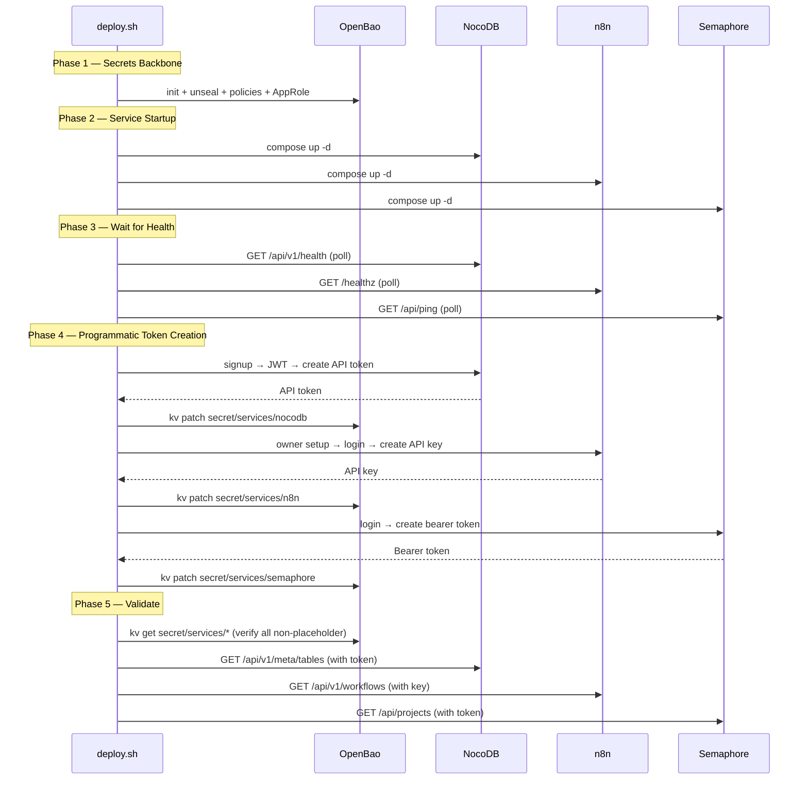

# Agent Cloud — Implementation Plan

## Agent Role Definitions

### NemoClaw (Engineer / Service Account)
NemoClaw is NVIDIA's open-source security stack wrapping OpenClaw. It runs headless inside a sandboxed OpenShell runtime with policy-enforced security, credential injection via YAML policies, and full audit logging.

**Best suited for:** Background automation, API integrations, health monitoring, CI/CD tasks, incident response, data aggregation, anything that runs unattended on a schedule or webhook trigger.

### Claude Cowork (Architect / Researcher)
Claude Cowork runs on the user's personal device with browser automation, local file access, and interactive GUI capabilities.

**Best suited for:** Research tasks, architecture decisions, browser-based workflows, document generation, visual verification, anything requiring personal context or GUI interaction.

---

## Services Involved

| Service | VM | Runtime | Purpose |
|---|---|---|---|
| OpenBao | openbao ({{ openbao_host }}) | Podman | Secrets management — KV v2, AppRole auth, database engine |
| NocoDB | nocodb ({{ nocodb_host }}) | Podman | Shared data layer — tables, views, REST API |
| n8n | n8n ({{ n8n_host }}) | Podman | Workflow automation — scheduling, webhooks, event routing |
| Semaphore | semaphore ({{ semaphore_host }}) | Podman | Ansible/task automation — playbooks against lab inventory |
| NemoClaw/OpenClaw | nemoclaw ({{ nemoclaw_host }}) | Docker (NOT podman) | Headless AI agent sandbox |
| NetBox | netbox ({{ netbox_host }}) | Podman | Infrastructure modeling — IPAM/DCIM + Diode discovery |
| Discord | — | API | Agent notification/interaction channel |
| GitHub | — | API | Repo management, issue tracking |
| Proxmox | aurora ({{ proxmox_host }}) | API | VM provisioning + infrastructure monitoring |

### Production Topology

Each service runs on its own VM, provisioned via the Proxmox API on aurora ({{ proxmox_host }}). OpenBao has been separated from NocoDB to give the secrets backbone an independent failure domain.

| VM Name | VMID | IP | Services | Port(s) | Runtime | Cores | Memory | Disk |
|---|---|---|---|---|---|---|---|---|
| `openbao` | 210 | `{{ openbao_host }}` | OpenBao | 8200 | Podman | 2 | 2 GB | 20 GB |
| `nocodb` | 161 | `{{ nocodb_host }}` | NocoDB + Postgres | 8181 | Podman | 2 | 4 GB | 40 GB |
| `n8n` | 118 | `{{ n8n_host }}` | n8n + Worker + Postgres + Redis | 5678 | Podman | 4 | 4 GB | 40 GB |
| `semaphore` | 117 | `{{ semaphore_host }}` | Semaphore + Postgres | 3000 | Podman | 2 | 2 GB | 20 GB |
| `nemoclaw` | 163 | `{{ nemoclaw_host }}` | NemoClaw + OpenShell | — | Docker | 4 | 8 GB | 60 GB |
| `netbox` | 116 | `{{ netbox_host }}` | NetBox + Diode Pipeline | 8000 | Podman | 2 | 4 GB | 40 GB |

All VMs are cloned from template VMID 9000 (Ubuntu 24.04 cloud-init) on the Proxmox cluster. VM placement is determined at provisioning time by cluster load; default target node is aurora. Resource specs are defined in `proxmox/vm-specs.yml`.

### Proxmox API Access

VM provisioning and monitoring uses the PVE REST API at `https://{{ proxmox_host }}:8006`. API token `{{ proxmox_token_id }}` stored in `proxmox/secrets/`. Auth header format: `Authorization: PVEAPIToken={{ proxmox_token_id }}=<token>`.

### Deployment Modes

1. **Semaphore (production, recommended)** — task templates trigger composable playbooks: sparse checkout → manage secrets → deploy.sh → verify health. All deployments should go through Semaphore.
2. **Ansible CLI (development)** — `ansible-playbook deploy-<service>.yml` runs the same composable playbook locally. Requires Semaphore environment variables for OpenBao access.
3. **Legacy CLI** — `orchestrate.sh` for quick local deploys (supports `--skip`, `--only`, `--dry-run`). Bypasses Ansible credential lifecycle — use only for local development.

> **Warning:** Running `deploy.sh` directly from the clone directory bypasses the Ansible secret lifecycle (no `manage-secrets.yml`, no env file templating). deploy.sh must run from the runtime directory `~/services/<name>/` with env files already templated by Ansible.

---

## Key Instructions

1. All deployment code lives in `platform/services/<service>/deployment/` within the **agent-cloud monorepo**
2. Container runtime is per-service: Docker for NetBox and NemoClaw, Podman for everything else. Set `container_engine` in inventory.
3. Never hardcode secrets, IPs, or usernames — all credentials go in OpenBao, all IPs in site-config (private)
4. OpenBao is the source of truth — AppRole auth at runtime, not tokens in env vars
5. Playbooks use wrapper pattern (`deploy-<service>.yml`) since Semaphore `extra_cli_arguments` is not supported
6. `become` is declared per-playbook, never in inventory. SSH keys from OpenBao, temp files cleaned in `always` blocks.
7. Audit for sensitive data before every push to this public repo

---

## Phase 0: Foundation

> **Legacy phase.** Phase 0 describes the initial local development bootstrap using monolithic deploy.sh scripts that handled secret generation, OpenBao interaction, and container lifecycle in a single script. This pattern has been superseded by the composable automation architecture documented in [AUTOMATION-COMPOSABILITY-PLAN.md](AUTOMATION-COMPOSABILITY-PLAN.md), where Ansible owns the secret lifecycle and deploy.sh is pure container operations. Phase 0 content is retained for historical context.

**Status:** FUNCTIONAL — 13 PASS / 0 FAIL / 8 WARN (placeholder credentials + NemoClaw pending)
**Full report:** [PHASE0-REPORT.md](PHASE0-REPORT.md)

### What Was Built

- **OpenBao** — Initialized with KV v2, database secrets engine, AppRole auth, `nemoclaw-read` and `nemoclaw-rotate` policies. Placeholder secrets seeded at `secret/services/{nocodb,github,discord,proxmox,n8n,semaphore}`. Currently on local dev; migrates to dedicated VM ({{ openbao_host }}) in Phase 0.5.
- **NocoDB** — Running with PostgreSQL backend, healthy on port 8181. Awaiting API token creation.
- **n8n** — Running in queue mode with worker node, PostgreSQL backend, Redis queue. Awaiting first login and API key creation.
- **Semaphore** — Running with PostgreSQL backend on port 3100 (3000 held by VS Code). Awaiting first login and API token creation.
- **NemoClaw config** — `agent-cloud.yaml` network policy and `sandboxes.json` staged in `nemoclaw/`. Ready to copy to `nemoclaw-deploy/config/` after credentials are validated.

### Phase 0 — Validation Criteria

| Check | Pass Condition |
|-------|---------------|
| OpenBao initialized | `bao status` shows `Initialized: true, Sealed: false` |
| KV v2 engine enabled | `bao secrets list` includes `secret/` |
| AppRole auth enabled | `bao auth list` includes `approle/` |
| Placeholder secrets seeded | `bao kv get secret/services/nocodb` returns data |
| NocoDB healthy | `curl http://localhost:8181/api/v1/health` → 200 |
| n8n healthy | `curl http://localhost:5678/healthz` → 200 |
| Semaphore healthy | `curl http://localhost:3000/api/ping` → 200 |
| validate.sh | 13 PASS / 0 FAIL |

**Smoke test:** Run `validate.sh` end-to-end. All container health checks pass. OpenBao CLI responds to `bao status`.

**Security:** OpenBao runs with `tls_disable=1` (acceptable for loopback in Phase 0). No credentials committed to git. *(Phase 0 used `secrets/` directory with `.gitignore`; this has been superseded by the source/runtime directory split — see Composable Automation Architecture section.)*

### Phase 0 Close-Out Checklist

Complete these in order — each step depends on the previous.

#### 1. Update Proxmox Host IP

Proxmox host is aurora at {{ proxmox_host }}. Update the two placeholder locations:

```bash
# NemoClaw network policy
sed -i 's/PROXMOX_HOST_PLACEHOLDER/{{ proxmox_host }}/' nemoclaw/agent-cloud.yaml

# OpenBao secret URL + token
ROOT_TOKEN=$(jq -r '.root_token' secrets/init.json)
podman exec -e "BAO_TOKEN=$ROOT_TOKEN" ac-openbao bao \
  kv patch secret/services/proxmox \
    url="https://{{ proxmox_host }}:8006" \
    token_id="{{ proxmox_token_id }}" \
    api_token="$(cat ../proxmox/secrets/{{ proxmox_token_id }}.txt)"
```

#### 2. Programmatic API Token Bootstrap

API tokens are created programmatically by each service's `deploy.sh` — no manual UI login required. This follows the pattern already proven in the NetBox deployment (`netbox/deploy.sh`).

| Service | Bootstrap Method | Admin Creation | Token Endpoint | Idempotency |
|---|---|---|---|---|
| **OpenBao** | CLI (`bao operator init`) | Root token from init | AppRole: `bao write auth/approle/login` | Check `bao status` for initialized state |
| **NocoDB** | REST API | `POST /api/v1/auth/user/signup` (first boot only) | `POST /api/v1/tokens` with JWT auth | Signin first; if 200, admin exists. List tokens before creating |
| **n8n** | REST API | `POST /api/v1/owner/setup` (first boot only) | `POST /api/v1/me/api-keys` (DB insert fallback) | Owner setup only works when no owner exists |
| **Semaphore** | REST API | Auto-created via `SEMAPHORE_ADMIN_PASSWORD` env var | `POST /api/auth/login` → `POST /api/user/tokens` | List tokens first (`GET /api/user/tokens`), skip if exists |
| **GitHub** | Manual (external) | N/A | Fine-grained PAT via GitHub.com Settings | N/A |
| **Discord** | Manual (external) | N/A | Bot token via Discord Developer Portal | N/A |
| **Proxmox** | Already done | N/A | Token `{{ proxmox_token_id }}` in `proxmox/secrets/` | N/A |

**Per-Service Bootstrap Details:**

**Semaphore** — Login via `POST /api/auth/login` with `{"auth":"admin","password":"<SEMAPHORE_ADMIN_PASSWORD>"}` returns a session cookie. Use that cookie to `POST /api/user/tokens` to create a bearer token. Store in OpenBao at `secret/services/semaphore`.

**NocoDB** — On first boot, `POST /api/v1/auth/user/signup` with `{"email":"admin@my-site.io","password":"<NOCODB_ADMIN_PASSWORD>"}` returns a JWT. Use the JWT to `POST /api/v1/tokens` (or fallback `POST /api/v1/meta/api-tokens` — endpoint varies by NocoDB version; deploy script tries both). Store in OpenBao at `secret/services/nocodb`.

**n8n** — On first boot, `POST /api/v1/owner/setup` creates the owner account. Login via `POST /api/v1/login` to get a session cookie. Use `POST /api/v1/me/api-keys` with `{"label":"nemoclaw-agent"}` to create an API key. **DB fallback:** if the API endpoint is unavailable, insert directly into the `api_key` table via `podman exec` into Postgres (key generated via `openssl rand -hex 20`, validated as hex-only before SQL insertion to prevent injection). Store in OpenBao at `secret/services/n8n`.

**External tokens (GitHub, Discord):** These are third-party services that require manual token creation. GitHub PAT must be fine-grained, scoped to target repos only (not org-wide) with Repository (read) and Issues (read/write) permissions. Discord bot token from Developer Portal with `bot` scope, `Send Messages` + `Read Message History` permissions, invited to target guild. Store both via `setup-secrets.sh`.

**Bootstrap sequence:** OpenBao first (secrets backbone) → NocoDB, n8n, Semaphore in parallel (each creates its own admin + API token) → store all tokens in OpenBao → NemoClaw last (reads tokens from OpenBao via AppRole).

> **Legacy diagram.** This Phase 0 bootstrap flow shows deploy.sh directly interacting with OpenBao. In the current composable architecture, Ansible `manage-secrets.yml` handles all OpenBao reads/writes and templates env files. deploy.sh performs container operations only. See [AUTOMATION-COMPOSABILITY-PLAN.md](AUTOMATION-COMPOSABILITY-PLAN.md).



**Security checks per step:**

| Step | Validation | Security Check |
|------|-----------|----------------|
| 1. Proxmox IP | `curl -sk https://{{ proxmox_host }}:8006/api2/json/version` → 200 | API token scoped to VM management only |
| 2. API tokens | Each `bao kv get secret/services/<svc>` returns non-placeholder values | Tokens created programmatically, no manual UI login |
| 3. External creds | `secret/services/github:pat` and `secret/services/discord:bot_token` are set | GitHub PAT fine-grained, Discord bot scoped to target guild |
| 4. Validation | `validate.sh` returns 15 PASS / 0 FAIL / 0 WARN | No credential exposure in validate output |
| 5. NemoClaw config | `agent-cloud.yaml` has real service endpoints, no placeholders | Network policy restricts to documented endpoints only |
| 6. Connectivity | NemoClaw reads from all 6 services without errors | All credentials from OpenBao AppRole, not env files |

#### 3. Store External Credentials in OpenBao

> **Legacy workflow.** In the current composable architecture, external credentials are stored via `manage-secrets.yml` with `type: user` secret definitions (never auto-generated). No `secrets/` directory or `setup-secrets.sh` script needed. The workflow below is the Phase 0 bootstrap path.

```bash
# Legacy Phase 0 bootstrap:
./scripts/setup-secrets.sh                    # Creates template, stores in OpenBao
nano secrets/service-credentials.env          # Fill in GitHub PAT + Discord bot token
./scripts/setup-secrets.sh                    # Second run stores values
```

#### 4. Validate

```bash
./scripts/validate.sh
```

**Target:** 15 PASS / 0 FAIL / 0 WARN. NemoClaw CLI check may WARN if not deployed on this machine.

#### 5. Migrate NemoClaw Config

```bash
cp nemoclaw/sandboxes.json ../nemoclaw-deploy/config/sandboxes.json
cp nemoclaw/agent-cloud.yaml ../nemoclaw-deploy/config/presets/agent-cloud.yaml
cd ../nemoclaw-deploy && ./deploy.sh --local
```

#### 6. NemoClaw Connectivity Smoke Test

One read operation per service after redeployment:

| Service | Test Operation | Success Condition |
|---|---|---|
| NocoDB | Fetch any row via API | HTTP 200, JSON response |
| GitHub | List issues on a repo | HTTP 200, issue array |
| Discord | Post a test message | Message appears in channel |
| Proxmox | `GET /api2/json/nodes` | HTTP 200, node status |
| n8n | `GET /api/v1/workflows` | HTTP 200, workflow list |
| Semaphore | `GET /api/projects` | HTTP 200, project list |

### Quick Health Check (Current State)

Run these anytime to verify infrastructure health without credentials:

```bash
podman ps --format "{{.Names}}\t{{.Status}}" | grep ac-
./scripts/unseal.sh                                          # if OpenBao was restarted
curl -s http://localhost:8181/api/v1/health                  # NocoDB
curl -s http://localhost:5678/healthz                        # n8n
curl -s http://localhost:3100/api/ping                       # Semaphore (3100 in local dev; 3000 in production)
./scripts/validate.sh

# OpenBao policy and AppRole verification (requires root token or privileged access)
ROOT_TOKEN=$(jq -r '.root_token' secrets/init.json)
podman exec -e "BAO_TOKEN=$ROOT_TOKEN" ac-openbao bao policy list
podman exec -e "BAO_TOKEN=$ROOT_TOKEN" ac-openbao bao read auth/approle/role/nemoclaw

# Enumerate all secrets (check for placeholders vs real values)
for svc in nocodb github discord proxmox n8n semaphore; do
  echo "--- $svc ---"
  podman exec -e "BAO_TOKEN=$ROOT_TOKEN" ac-openbao bao kv get secret/services/$svc
done
```

---

## Phase 0.5: Per-VM Deployment & Infrastructure Automation

**Status:** DONE — OpenBao VM (210) provisioned on alphacentauri, OpenBao v2.5.2 deployed via Semaphore. All deployment code consolidated into the **agent-cloud monorepo** (including openbao, previously in a separate private repo). Only two repos: agent-cloud (public) + site-config (private). `infra-automation` and `openbao` repos deprecated.

**Goal:** Split the monolithic compose stack into per-VM deployments, provision VMs via Proxmox API, and wire up Semaphore for ongoing configuration management. When complete, each service runs on its own VM with programmatic credential bootstrap — no manual UI steps except for GitHub PAT and Discord bot token.

> **Legacy phase.** Phase 0.5 established per-VM deployment with monolithic deploy.sh scripts that handled the full lifecycle (secret generation, container operations, OpenBao token storage). The deploy.sh responsibilities and secret management patterns described here have since been decomposed per [AUTOMATION-COMPOSABILITY-PLAN.md](AUTOMATION-COMPOSABILITY-PLAN.md): Ansible now owns secret lifecycle, deploy.sh is pure container operations, and the source/runtime directory split replaces `secrets/` directories. The infrastructure work (compose files, Proxmox provisioning, Semaphore playbooks) remains valid.

**Historical note:** Per-VM deployment was originally designed in a separate SYSTEM-DESIGN-VM-DEPLOYMENT.md document. That document has been deleted; all relevant content has been absorbed into this plan.

### What Was Built

- **Per-service compose files** — `vms/{openbao,nocodb,n8n,semaphore}/compose.yml` extracted from the monolithic compose
- **Shared libraries** — `lib/common.sh` (logging, secrets, runtime detection, compose wrapper, health waiters, env generators) and `lib/bao-client.sh` (HTTP-only OpenBao client with AppRole auth, KV v2 operations)
- **Deploy scripts** — `vms/{openbao,nocodb,n8n,semaphore}/deploy.sh` with programmatic API key bootstrap following the 5-step pattern (generate → start → bootstrap → store in OpenBao → validate)
- **Delegation wrappers** — `vms/nemoclaw/deploy.sh` and `vms/netbox/deploy.sh` delegate to their respective repos
- **Orchestrator** — `orchestrate.sh` deploys all services in dependency order with `--skip`, `--only`, `--dry-run` options
- **Per-service AppRole policies** — `vms/openbao/config/policies/{nocodb,n8n,semaphore}-write.hcl` (least-privilege, write-scoped to own path only)
- **OpenBao AppRole setup** — `vms/openbao/deploy.sh` creates per-service roles (nemoclaw, nocodb, n8n, semaphore) with their respective policies
- **Semaphore orchestration** — `semaphore/setup-project.sh` (programmatic project configuration via API), `semaphore/inventory/{local,production}.yml`, `semaphore/playbooks/{deploy-all,deploy-service,update-service,validate-all}.yml`

### Phase 0.5 — Validation Criteria

| Check | Pass Condition |
|-------|---------------|
| Each deploy.sh completes 5 steps | No errors, health check passes at end |
| Deploy idempotency | Running deploy.sh twice produces no errors |
| API tokens in OpenBao | `bao kv get secret/services/<svc>` returns non-placeholder values |
| AppRole auth per service | Each service authenticates with its own role-id/secret-id |
| Health endpoints respond | Each service returns HTTP 200 within 30s of compose up |
| Token round-trip | Fetch token from OpenBao, call service API, get HTTP 200 |
| Semaphore task templates | 25+ templates created via setup-project.sh API |

**Smoke tests per step:**
- Step 3 (deploy.sh): Run `deploy.sh` on each VM, verify all 5 steps complete
- Step 6 (orchestrate.sh): `--dry-run` shows correct order, `--only openbao` deploys only OpenBao
- Step 7 (Semaphore): Task template list via API matches expected 25+ templates

**Architectural notes:** OpenBao on separate VM for independent failure domain. HTTP-only bao-client.sh — no binary dependency. Bootstrap order: OpenBao → services (parallel) → NemoClaw (last).

**Security:** Credentials via stdin not CLI args. SQL injection protection in n8n DB fallback. Per-service AppRole policies enforce least privilege. Cookie jar cleanup on all exit paths.

### Directory Structure (Legacy — migrated to `platform/services/<name>/deployment/`)

> **Note:** This structure reflects the Phase 0.5 layout under `deployments/agent-cloud/`. All deployment code has since been migrated to the monorepo pattern at `platform/services/<name>/deployment/`. The directory listing below is preserved for historical reference only — see the repo CLAUDE.md "Repository Structure" section for the current layout.

```
deployments/agent-cloud/
├── orchestrate.sh                       # ✅ Full-stack deploy in dependency order
├── lib/
│   ├── common.sh                        # ✅ Shared library (logging, secrets, compose, health, env gen)
│   └── bao-client.sh                    # ✅ HTTP-only OpenBao client (curl+jq)
├── vms/
│   ├── openbao/
│   │   ├── compose.yml                  # ✅ OpenBao standalone
│   │   ├── deploy.sh                    # ✅ Init, unseal, engines, policies, per-service AppRole, seeds
│   │   └── config/
│   │       ├── openbao.hcl              # ✅ Server config
│   │       └── policies/
│   │           ├── nemoclaw-read.hcl    # ✅ Read-only all service secrets
│   │           ├── nemoclaw-rotate.hcl  # ✅ Dynamic DB credentials
│   │           ├── nocodb-write.hcl     # ✅ NocoDB VM: write own path
│   │           ├── n8n-write.hcl        # ✅ n8n VM: write own path
│   │           └── semaphore-write.hcl  # ✅ Semaphore VM: write own path
│   ├── nocodb/
│   │   ├── compose.yml                  # ✅ NocoDB + Postgres
│   │   └── deploy.sh                    # ✅ Signup/signin → API token → OpenBao
│   ├── n8n/
│   │   ├── compose.yml                  # ✅ n8n + Worker + Postgres + Redis
│   │   ├── deploy.sh                    # ✅ Owner setup → login → API key (DB fallback) → OpenBao
│   │   └── config/n8n-init-data.sh      # ✅ Creates n8n_user in Postgres
│   ├── semaphore/
│   │   ├── compose.yml                  # ✅ Semaphore + Postgres
│   │   └── deploy.sh                    # ✅ Login → API token → OpenBao
│   ├── nemoclaw/
│   │   └── deploy.sh                    # ✅ Delegates to nemoclaw-deploy repo
│   └── netbox/
│       └── deploy.sh                    # ✅ Delegates to netbox repo
├── semaphore/
│   ├── setup-project.sh                 # ✅ Programmatic Semaphore project config via API
│   ├── inventory/
│   │   ├── local.yml                    # ✅ Local dev: all on localhost
│   │   └── production.yml               # ✅ Production: per-VM inventory
│   └── playbooks/
│       ├── deploy-all.yml               # ✅ Deploy all in dependency order (4 phases)
│       ├── deploy-service.yml           # ✅ Single service (-e target_service=<name>)
│       ├── update-service.yml           # ✅ Pull latest + restart + validate
│       ├── validate-all.yml             # ✅ Health check all services
│       ├── proxmox-validate.yml         # ✅ Pre/post cluster validation (8 checks)
│       ├── provision-template.yml       # ✅ Create Ubuntu 24.04 template from ISO
│       └── provision-vm.yml             # ✅ Clone template → configure → start VM
├── proxmox/                             # ✅ Proxmox API + cloud-init + VM specs
│   ├── lib/pve-api.sh                  # ✅ REST API wrapper (curl+jq, 250+ lines)
│   ├── pre-validate.sh                 # ✅ CLI pre-validation (8 checks)
│   ├── vm-specs.yml                    # ✅ VM resource specs for all 6 services
│   ├── cloud-init/
│   │   ├── autoinstall-user-data.yml   # ✅ Ubuntu autoinstall for template
│   │   ├── meta-data                   # ✅ NoCloud meta-data
│   │   └── build-seed-iso.sh          # ✅ Builds cidata ISO
│   └── secrets/                         # gitignored (SSH keys, API token)
├── compose.yml                          # Legacy monolithic compose (Phase 0)
├── config/                              # Legacy monolithic config
└── scripts/                             # Legacy monolithic scripts
```

### Implementation Progress

```
Step 1: Split compose.yml into per-service compose files          ✅ DONE
  │     vms/{openbao,nocodb,n8n,semaphore}/compose.yml
  │     YAML validated, services parsed correctly
  │
Step 2: Write lib/common.sh + lib/bao-client.sh                  ✅ DONE
  │     Source guards, TOCTOU-safe secrets, runtime detection
  │     All bash syntax validated
  │
Step 3: Write deploy.sh for each service                          ✅ DONE
  │     5-step pattern: generate → start → bootstrap → OpenBao → validate
  │     Security: stdin for creds, hex-validated DB fallback, EXIT traps
  │     Per-service AppRole roles created by OpenBao deploy.sh
  │
Step 4: Provision OpenBao VM via Proxmox API                      ✅ DONE (2026-03-28)
  │     pve-api.sh library, pre-validate.sh, vm-specs.yml
  │     Ansible playbooks: proxmox-validate, provision-template, provision-vm
  │     Validated against live PVE 9.0.3 cluster (8 PASS / 0 FAIL)
  │
Step 5: Deploy services to existing VMs                           ⬜ PENDING
  │     Requires VM access; deploy scripts ready to SCP+run
  │
Step 6: Write orchestrate.sh                                      ✅ DONE
  │     Dependency-ordered with --skip, --only, --dry-run
  │     Stops on OpenBao failure, continues on other failures
  │
Step 7: Wire Semaphore playbooks for ongoing management           ✅ DONE
        setup-project.sh, 4 playbooks, local + production inventory
        Bootstrap: deploy Semaphore → setup-project.sh → use templates
```

### Per-Service deploy.sh Pattern

> **Legacy pattern (Phase 0.5).** The 5-step monolithic pattern below has been superseded by the composable architecture. See "Composable Automation Architecture" section below and [AUTOMATION-COMPOSABILITY-PLAN.md](AUTOMATION-COMPOSABILITY-PLAN.md) for the current pattern where Ansible owns secrets and deploy.sh is pure container operations.

**Original 5-step pattern (historical):**

1. ~~**Generate secrets**~~ — now handled by Ansible `manage-secrets.yml`
2. **Start services** — `compose up -d`; wait for health endpoint *(still in deploy.sh)*
3. **Bootstrap credentials** — create admin user + API token via REST API *(now split into post-deploy.sh)*
4. ~~**Store in OpenBao**~~ — now handled by Ansible Phase 4 (sync runtime creds to OpenBao)
5. ~~**Validate**~~ — now handled by Ansible `verify-health.yml`

### OpenBao Client Library (bao-client.sh)

> **Legacy (Phase 0.5).** In the current composable architecture, deploy.sh does not authenticate to OpenBao or use bao-client.sh. Ansible manages all OpenBao interactions natively via `community.hashi_vault`. The bao-client.sh library remains in `platform/lib/` for edge cases but is not used in the deploy path.

The library wraps the OpenBao REST API using curl + jq (no binary required):

- `bao_authenticate()` — AppRole login
- `bao_authenticate_root()` — Root token auth (initial bootstrap only)
- `bao_kv_get <path>` / `bao_kv_get_field <path> <field>` — read secrets
- `bao_kv_put <path> key=value...` / `bao_kv_patch <path> key=value...` — write/update secrets
- `bao_health()` / `bao_wait_ready()` — health checking

### AppRole Identities (Implemented)

> **Updated:** AppRole creation has been decoupled from OpenBao's deploy.sh. In the current composable architecture, any service playbook provisions its own AppRole via `tasks/manage-approle.yml` with enforced TTLs. See [AUTOMATION-COMPOSABILITY-PLAN.md](AUTOMATION-COMPOSABILITY-PLAN.md) "AppRole Management (Composable)" section.

| Role | Policy | Access | Provisioned By |
|---|---|---|---|
| `nemoclaw` | `nemoclaw-read` | `secret/services/*` (read-only) | `manage-approle.yml` |
| `nocodb` | `nocodb-write` | `secret/services/nocodb` (read/write) | `manage-approle.yml` |
| `n8n` | `n8n-write` | `secret/services/n8n` (read/write) | `manage-approle.yml` |
| `semaphore` | `semaphore-write` | `secret/services/semaphore` (read/write) | `manage-approle.yml` |
| `orb-agent` | `orb-agent-read` | `secret/services/netbox/orb_agent_*` (read) | `manage-approle.yml` |

**TTL Enforcement:** All AppRoles created via `manage-approle.yml` enforce `secret_id_ttl: 2160h` (90 days) and `token_num_uses: 25` by default. Semaphore's orchestrator AppRole is the documented exception (unlimited uses due to cross-service orchestration role).

**Credential Flow (Composable Pattern):**

In the composable architecture, there are no AppRole credential files on service VMs. The flow is:

1. **Semaphore environment JSON** holds orchestrator AppRole `bao_role_id` + `bao_secret_id` + `openbao_addr`
2. **Ansible `community.hashi_vault`** authenticates to OpenBao at playbook runtime (in memory)
3. **`manage-secrets.yml`** fetches/generates secrets and templates env files to `~/services/<name>/`
4. **deploy.sh** reads only from env files — never authenticates to OpenBao
5. **post-deploy.sh** creates runtime credentials (e.g., OAuth2 clients), writes to `.env`
6. **Ansible Phase 4** syncs any runtime-created credentials back to OpenBao

Per-service AppRoles are provisioned via `manage-approle.yml` and stored in OpenBao at `secret/services/approles/<name>`. No `role-id.txt`/`secret-id.txt` files on VMs.

### Semaphore Orchestration (Implemented)

Semaphore is the deployment orchestrator for production. Bootstrap sequence:
1. `deploy-semaphore.yml` — brings up Semaphore + creates API token (chicken-and-egg)
2. `platform/semaphore/setup-templates.yml` — applies task templates from `platform/semaphore/templates.yml` (config-as-code, 25+ templates)
3. Use Semaphore UI or API to run templates

Task templates are managed as code in `platform/semaphore/templates.yml` — not through ad-hoc API calls. Adding a new template: add entry to `templates.yml`, run `setup-templates.yml`, verify in UI.

Task templates include: Deploy All, Validate All, Deploy/Update/Clean Deploy per service, Validate Proxmox Cluster, Create VM Template, Provision per service, Distribute SSH Keys, Harden SSH, Rotate Diode Creds, Audit Credentials.

### Proxmox VM Provisioning (Implemented)

Fully implemented with Ansible playbooks for Semaphore orchestration:
- **`proxmox/lib/pve-api.sh`** — REST API wrapper (node ops, VM CRUD, clone, template, cloud-init, storage, task tracking, validation). Key functions: `pve_clone_vm` (clone template), `pve_configure_vm` (set cores/memory/IP via cloud-init `ipconfig0`), `pve_start_vm`, `pve_vm_status`. Auth via `PVEAPIToken` header.
- **`proxmox/pre-validate.sh`** — CLI pre-validation (8 checks against live cluster)
- **`proxmox/vm-specs.yml`** — Resource specs for all 6 services (cores, memory, disk, IP, node) — see Production Topology table above
- **`proxmox/cloud-init/`** — Ubuntu autoinstall config + seed ISO builder
- **Ansible playbooks** — `proxmox-validate.yml` (pre/post validation), `provision-template.yml` (template from ISO), `provision-vm.yml` (clone + configure + start)
- **Semaphore templates** — 8 new task templates (validate, create template, provision each service)
- **Validated** against PVE 9.0.3 cluster: API, 11 nodes, alphacentauri storage (931GB on vm-lvms), Ubuntu ISO on SharedISOs, SSH keys, network bridge vmbr0

**Known issue: VM template creation.** Automated autoinstall via ISO + seed ISO hangs on serial console. Template creation currently requires manual installation: install from `SharedISOs:iso/ubuntu-24.04.3-live-server-amd64.iso`, 2 CPU/2GB/20GB on `vm-lvms`, install packages (`qemu-guest-agent cloud-init podman curl jq ansible genisoimage`), create `{{ ansible_user }}` user with SSH key + NOPASSWD sudo, run `cloud-init clean`, truncate machine-id, remove SSH host keys, add cloud-init drive, convert to template (VMID 9000). `provision-template.yml` automates the post-install steps.

### Phase 0.5 Validation Checklist

- [x] Each service has its own `vms/<service>/compose.yml` and `deploy.sh`
- [x] Per-service AppRole identities with least-privilege write policies
- [x] `orchestrate.sh` deploys the full stack in one command
- [x] Semaphore has playbooks for deploying/updating/validating each service
- [x] Semaphore project setup is programmatic (`setup-project.sh`)
- [x] Deploy scripts use stdin for credential passing (no process list exposure)
- [x] n8n DB fallback has SQL injection protection (hex validation)
- [x] Local deployment tested: all 4 services deploy, bootstrap, store tokens, validate (2026-03-28)
- [x] Idempotency verified: second run is no-op with all services healthy
- [x] Ansible playbooks validated: `validate-all.yml` reports all services HEALTHY
- [x] Semaphore project setup: 25+ task templates created via API
- [x] NemoClaw network policy updated: OpenBao = {{ openbao_host }}
- [x] Proxmox API wrapper written and validated against live PVE 9.0.3 cluster (2026-03-28)
- [x] VM template provisioning playbook with autoinstall cloud-init (2026-03-28)
- [x] VM cloning playbook with cloud-init (static IP, SSH key, DNS) (2026-03-28)
- [x] Pre/post validation playbook (8 checks) integrated into provisioning workflow (2026-03-28)
- [x] Semaphore task templates for all provisioning operations (2026-03-28)
- [ ] OpenBao runs on its own VM at {{ openbao_host }} (template + clone ready, needs execution)
- [ ] NocoDB, n8n, Semaphore each run on their assigned VMs (playbooks ready)
- [ ] `validate.sh` updated for multi-VM topology (checks remote health endpoints)

---

## Phase 0.75: Semaphore Automation Infrastructure

**Status:** COMPLETE — Monorepo consolidated, SSH hardened, Semaphore pipeline operational, NetBox deployed with Diode discovery + Orb Agent (OpenBao vault integration). Composable automation implemented. Dynamic inventory migration deferred to Phase 1.

**Goal:** Establish Semaphore as the production-grade automation platform with git-based workflows, OpenBao-backed credentials, and full service deployment automation.

### Step 1: Monorepo Consolidation (DONE — 2026-03-30/04-01)

Consolidated all deployment code into the **agent-cloud monorepo**. Deprecated `infra-automation` and `openbao` repos.

**Completed:**
- [x] Migrate all playbooks to `platform/playbooks/` with shared task files
- [x] Migrate openbao deployment into `platform/services/openbao/deployment/` (parameterized, secrets gitignored)
- [x] Standardize inventory groups to `_svc` suffix (openbao_svc, nocodb_svc, etc.)
- [x] Shared `tasks/clone-and-deploy.yml` for monorepo clone pattern
- [x] HTTPS clone (public repo, no deploy key needed)
- [x] Semaphore project reconfigured to point at agent-cloud monorepo
- [x] 20 task templates configured with wrapper playbooks
- [x] `collections/requirements.yml` for auto-installing hashi_vault + posix
- [x] Remove all hardcoded usernames from public playbooks
- [x] Remove all IPs from plan/ files (replaced with `{{ }}` placeholders)

### Step 2: SSH Key Authentication (DONE — 2026-04-01)

Eliminated password-based SSH. Per-service ed25519 keys stored in OpenBao.

**Completed:**
- [x] Generated 6 per-service SSH key pairs (stored in site-config + OpenBao)
- [x] `distribute-ssh-keys.yml` — deploys keys from OpenBao, verifies key auth
- [x] `harden-ssh.yml` — NOPASSWD sudo, sshd lockdown, post-lockdown verification
- [x] Management key in Semaphore key store for all VM access
- [x] Password auth disabled, root login disabled on all 6 VMs
- [x] All verification automated (password rejected + key auth confirmed)

### Step 3: Service Deployment via Semaphore (NETBOX COMPLETE — 2026-04-04)

**Completed:**
- [x] `install-docker.yml` — Docker CE install playbook (official repo)
- [x] Docker installed on NetBox VM
- [x] NetBox fully deployed via composable 5-phase pipeline (2026-04-04)
- [x] Diode discovery pipeline operational (ingester, reconciler, auth, Hydra)
- [x] Orb Agent deployed with OpenBao vault integration (SYN scan + SNMP discovery)
- [x] 32 IPs + pfSense gateway device discovered in NetBox
- [x] Composable automation: manage-secrets, manage-diode-credentials, manage-approle, deploy-orb-agent
- [x] Semaphore templates managed as code (platform/semaphore/templates.yml)

**Pending:**
- [ ] Deploy NocoDB via composable pattern
- [ ] Deploy n8n via composable pattern
- [ ] Create run-pfsense-sync.yml as independent 15-min scheduled workflow
- [x] Create dedicated orb-agent AppRole (done 2026-04-04 — policy: read secret/services/netbox, TTL 4h)
- [ ] Enable OpenTelemetry metrics export from orb-agent to o11y stack
      Config: `common.otel.grpc` endpoint pointing at OTel collector, `agent_labels` for environment/service tagging
      Ref: https://github.com/netboxlabs/orb-agent/blob/develop/docs/config_samples.md

### Step 4: Remaining Infrastructure (PENDING)

- [ ] NetBox dynamic inventory (`netbox.netbox.nb_inventory` plugin)
- [ ] Migrate playbooks from static inventory to dynamic
- [ ] Webhook for auto-sync on push to agent-cloud
- [ ] Set up Semaphore MCP server for task management
- [ ] Set up Proxmox MCP server for VM management

### Phase 0.75 — Validation Criteria

**Step 1 (Monorepo):**

| Check | Pass Condition |
|-------|---------------|
| All playbooks syntax check | `ansible-playbook --syntax-check` passes for every `.yml` |
| Inventory groups resolve | `ansible-inventory --graph` shows `_svc` groups with correct hosts |
| No secrets in public repo | `grep -r '192.168' platform/ plan/` returns only `{{ }}` placeholders |
| Semaphore templates point at agent-cloud | All 20 templates use repo id for agent-cloud |
| HTTPS clone works | Semaphore clones via `https://github.com/uhstray-io/agent-cloud.git` |

**Smoke test:** Run "Validate All Services" in Semaphore — all VMs reachable, health checks pass.

**Security:** No IPs, usernames, or credentials in agent-cloud repo. Template variables (`{{ }}`) only. `collections/requirements.yml` auto-installs dependencies.

**Step 2 (SSH):**

| Check | Pass Condition |
|-------|---------------|
| Per-service keys in OpenBao | `bao kv get secret/services/ssh/<svc>` returns private + public key |
| Keys deployed to VMs | `authorized_keys` on each VM contains management + service key |
| Key auth works | `ssh -i <mgmt_key> {{ ansible_user }}@<IP> hostname` succeeds |
| Password auth disabled | `ssh -o PubkeyAuthentication=no <IP>` → "Permission denied (publickey)" |
| Root login disabled | `ssh root@<IP>` → rejected |
| NOPASSWD sudo | `ssh <IP> sudo whoami` → "root" (no password prompt) |

**Smoke test:** Run `distribute-ssh-keys.yml` → all keys deployed + verified. Run `harden-ssh.yml` → password rejected, key confirmed on all VMs.

**Security:** Always verify key auth works BEFORE disabling password auth. Per-service keys provide isolation — compromise of one key affects only one VM. Management key stored in Semaphore key store + OpenBao.

**Step 3 (Service Deployment):**

| Check | Pass Condition |
|-------|---------------|
| NetBox deploy completes all 17 steps | deploy.sh exits 0, health check passes |
| NocoDB deploy via Semaphore | Task succeeds, HTTP 200 at health endpoint |
| n8n deploy via Semaphore | Task succeeds, HTTP 200 at /healthz |
| Monorepo cloned on each VM | `~/agent-cloud/` exists, `~/services/<service>/` runtime dir exists with env files and compose symlink |
| Secrets stored in OpenBao | `bao kv get secret/services/netbox` returns superuser_password, url |

**Smoke test:** Run "Validate All Services" — all 6 services HEALTHY. Run each "Deploy" template once.

**Security:** deploy.sh runs as `{{ ansible_user }}` (not root). `become: false` on clone/deploy tasks prevents root-owned files. CONTAINER_ENGINE set per host in inventory.

### Step 2 (Legacy): OpenBao as Semaphore Credential Manager

Eliminate file-based secrets. Playbooks authenticate to OpenBao via AppRole at runtime and fetch credentials on demand.

**Architecture:**
```
Semaphore key store (AppRole role-id + secret-id only)
    ↓ playbook starts
community.hashi_vault lookup
    ↓ AppRole auth
OpenBao ({{ openbao_host }}:8200)
    ↓ scoped token
secret/services/proxmox → PVE API token
secret/services/netbox → NetBox API token
secret/services/* → all service credentials
```

**Playbook pattern:**
```yaml
vars:
  _bao_url: "http://{{ openbao_host }}:8200"
  _bao_role_id: "{{ lookup('env', 'SEMAPHORE_BAO_ROLE_ID') }}"
  _bao_secret_id: "{{ lookup('env', 'SEMAPHORE_BAO_SECRET_ID') }}"
  pve_token: "{{ lookup('community.hashi_vault.hashi_vault',
    'secret/data/services/proxmox:api_token',
    url=_bao_url, auth_method='approle',
    role_id=_bao_role_id, secret_id=_bao_secret_id) }}"
```

**Checklist:**
- [x] Verify `semaphore` AppRole exists in OpenBao (2026-03-30)
- [x] Create `semaphore-read` policy granting read to `secret/services/*` (2026-03-30)
- [x] Store Proxmox API token in OpenBao at `secret/services/proxmox` (2026-03-30)
- [x] Store SSH public key in OpenBao at `secret/services/ssh` (2026-03-30)
- [x] Store Semaphore VM credentials in OpenBao at `secret/services/semaphore-vm` (2026-03-30)
- [x] Install `hvac` Python library in Semaphore container (required for vault lookup) (2026-03-30)
- [x] `collections/requirements.yml` added to infra-automation for `community.hashi_vault` (2026-03-30)
- [x] Store AppRole role-id + secret-id in Semaphore environment JSON (2026-03-30)
- [x] Refactor `proxmox-validate.yml` to fetch PVE token + SSH key from OpenBao (2026-03-30)
- [x] Refactor `provision-vm.yml` to fetch PVE token + SSH key from OpenBao (2026-03-30)
- [x] Remove all `lookup('file', ...)` secret reads from infra-automation playbooks (2026-03-30)
- [x] Test: `Validate Proxmox Cluster` via Semaphore with OpenBao-backed credentials — 9 PASS / 0 FAIL (2026-03-30)
- [ ] Refactor `deploy-service.yml` to fetch service-specific credentials from OpenBao

### Step 3: NetBox Dynamic Inventory via Diode

Replace static `production.yml` inventory with NetBox as the single source of truth for IP addresses and VM metadata. Uses Option B (hybrid): `vm-specs.yml` for initial provisioning, Diode auto-discovers running VMs into NetBox, Semaphore switches to dynamic inventory once NetBox is populated.

**Architecture:**
```
Proxmox cluster ({{ proxmox_host }})
pfSense ({{ pfsense_host }})
Network devices (SNMP)
    ↓ Diode Orb agent (central poller)
NetBox ({{ netbox_host }}:8000)
    ↓ netbox.netbox.nb_inventory plugin
Semaphore dynamic inventory
    ↓
Ansible playbooks (deploy, update, validate)
```

**Diode Orb Agent — Central Poller:**
A single Orb agent runs on the NetBox VM ({{ netbox_host }}) and performs:
- **Proxmox discovery**: Polls PVE API → discovers all VMs, their IPs, node placement, resource allocation
- **pfSense discovery**: Polls pfSense API → discovers DHCP leases, firewall rules, interfaces
- **Network discovery**: Scans subnets for active hosts, discovers devices
- **SNMP discovery**: Polls switches/routers for interface data, LLDP neighbors, VLAN assignments

All discovered data is pushed to NetBox via the Diode ingestion pipeline, keeping NetBox automatically up-to-date.

**Semaphore Dynamic Inventory Config:**
```yaml
# In Semaphore inventory (type: netbox.netbox.nb_inventory)
plugin: netbox.netbox.nb_inventory
api_endpoint: http://{{ netbox_host }}:8000
token: "{{ lookup('community.hashi_vault.hashi_vault', 'secret/data/services/netbox:api_token', ...) }}"
validate_certs: false
group_by:
  - cluster
  - role
  - tags
compose:
  ansible_host: primary_ip4.address | ansible.utils.ipaddr('address')
  service_name: name
  service_url: "http://{{ primary_ip4.address | ansible.utils.ipaddr('address') }}:{{ custom_fields.service_port | default('') }}"
```

**Transition Plan:**
1. `vm-specs.yml` remains the provisioning source (defines what *should* exist)
2. After VMs are provisioned and running, Diode auto-discovers them into NetBox
3. Once NetBox has accurate VM data, create dynamic inventory in Semaphore
4. Update deploy/update/validate playbooks to use dynamic inventory
5. `vm-specs.yml` retained as the "desired state" for provisioning new VMs; NetBox becomes the "actual state" for managing existing VMs

**Checklist:**
- [ ] Deploy NetBox to production VM ({{ netbox_host }}) — blocked by podman networking on macOS; deploy on VM directly
- [ ] Configure Diode Orb agent on NetBox VM with Proxmox API credentials
- [ ] Configure Diode pfSense discovery (pfSense API at {{ pfsense_host }})
- [ ] Configure Diode network/SNMP discovery for switches and other devices
- [ ] Verify VMs appear in NetBox with correct IPs after Diode sync
- [ ] Install `netbox.netbox` collection on Semaphore VM: `ansible-galaxy collection install netbox.netbox`
- [ ] Install `ansible.utils` collection (for `ipaddr` filter): `ansible-galaxy collection install ansible.utils`
- [ ] Create dynamic inventory in Semaphore using `netbox.netbox.nb_inventory` plugin
- [ ] NetBox API token fetched from OpenBao (requires Step 2 complete)
- [ ] Test: run `Validate All Services` using NetBox dynamic inventory
- [ ] Migrate deploy/update playbooks from static `production.yml` to dynamic inventory
- [ ] Add NetBox custom fields: `service_port`, `deploy_dir`, `container_runtime` (for playbook compatibility)

### Step 4: Semaphore Runner on Every VM

Each provisioned VM includes a pre-pulled Semaphore runner. At provision time, the runner is configured with the registration token and server URL, then starts automatically.

**Current state:** Runner image pre-pulled in VM template. `provision-vm.yml` configures and starts the runner via SSH after boot.

**Checklist:**
- [x] Runner image pre-pulled in VM template (podman pull during template creation)
- [x] Runner configuration in provision-vm.yml (inject token + enable systemd service)
- [ ] Runner health monitoring via Semaphore API (`GET /api/runners`)
- [ ] Runner auto-registration verification in post-provision validation playbook
- [ ] Document runner troubleshooting (restart, re-register, logs)

### Phase 0.75 Validation Checklist

When Phase 0.75 is complete:
- [x] Semaphore project points to GitHub repo (not local path) (2026-03-29)
- [x] Playbook changes deployed via `git push` → Semaphore auto-sync (2026-03-29)
- [x] All secrets fetched from OpenBao at runtime (no file-based lookups) (2026-03-30)
- [x] Only AppRole role-id/secret-id stored in Semaphore environment JSON (2026-03-30)
- [ ] NetBox contains all VMs with correct IPs (populated by Diode)
- [ ] Semaphore uses NetBox dynamic inventory for deploy/update/validate playbooks
- [ ] Diode Orb agent running on NetBox VM, auto-syncing from Proxmox + pfSense + SNMP
- [ ] Every provisioned VM has an active Semaphore runner
- [ ] `vm-specs.yml` used only for new VM provisioning; NetBox is source of truth for existing VMs

---

## Composable Automation Architecture

**Status:** IMPLEMENTED for NetBox. NocoDB and n8n rollout pending.
**Full specification:** [AUTOMATION-COMPOSABILITY-PLAN.md](AUTOMATION-COMPOSABILITY-PLAN.md)

This section summarizes the composable automation patterns that govern all service deployments going forward. Phase 0/0.5 established the initial infrastructure; this architecture decomposes the monolithic deploy.sh into reusable Ansible building blocks.

### Core Principles

1. **OpenBao is the single source of truth** — No `secrets/` directory on VMs. No local secret generation. Ansible fetches from OpenBao, templates compose-ready env files.
2. **Source/runtime directory split** — `~/agent-cloud/` is a read-only sparse git checkout. `~/services/<name>/` is the mutable runtime directory with env files and symlinks to compose file and libs. Filesystem isolation replaces `.gitignore` as the security boundary.
3. **deploy.sh is pure container operations** — No secret generation, no OpenBao interaction, no `generate-secrets.sh`. Verifies env files exist (fails if Ansible didn't run). Sources libs from clone via `CLONE_DIR`.
4. **deploy.sh + post-deploy.sh split** — deploy.sh handles infrastructure (clone upstream deps, pull/build images, start compose, wait for health). post-deploy.sh handles application (DB migrations, admin creation, OAuth2 registration, agent credentials). Independent retry.
5. **Config-as-code** — Semaphore templates managed via `platform/semaphore/templates.yml` + `setup-templates.yml` (Ansible playbook). No ad-hoc API calls.

### 4-Phase Composable Playbook Pattern

Every `deploy-<service>.yml` follows this structure:

```
Phase 1: Sparse Checkout     → sparse-checkout.yml (clone ~/agent-cloud/ with minimal paths)
Phase 2: Secrets + Runtime   → manage-secrets.yml (OpenBao → Jinja2 → env files)
                             + setup-runtime-dir.yml (create ~/services/<name>/, symlinks)
Phase 3: Container Ops       → run-deploy.yml (execute deploy.sh from runtime dir)
Phase 4: Verify              → verify-health.yml (HTTP health check with retries)
```

**Variable contract:** `_monorepo_dir` (read-only clone), `_deploy_dir` (source code within clone), `_runtime_dir` (mutable working directory).

### Composable Task Library

| Task | Purpose | Status |
|------|---------|--------|
| `manage-secrets.yml` | Fetch/generate secrets from OpenBao, template env files | Implemented |
| `manage-approle.yml` | Self-service AppRole + policy provisioning with TTL enforcement | Implemented |
| `manage-diode-credentials.yml` | Create fresh Diode orb-agent credentials | Implemented |
| `sparse-checkout.yml` | Sparse-clone monorepo with service-specific paths | Planned |
| `setup-runtime-dir.yml` | Create `~/services/<name>/`, set up symlinks to clone | Planned |
| `run-deploy.yml` | Execute deploy.sh from runtime dir with `CLONE_DIR` env var | Planned |
| `verify-health.yml` | HTTP health check with retries and backoff | Planned |
| `clean-service.yml` | Destroy containers, volumes, runtime dir, clone | Implemented |
| `write-secret-metadata.yml` | Write KV v2 lifecycle metadata after secret store | Planned |
| `rotate-credential.yml` | Generic Create→Verify→Retire rotation wrapper | Planned |
| `revoke-service-credentials.yml` | Revoke AppRole secret_ids + Hydra clients | Planned |
| `audit-credentials.yml` | Weekly credential inventory + stale detection | Planned |

### Secret Lifecycle

**First deploy:** `manage-secrets.yml` checks OpenBao (empty) → generates in Ansible memory → stores in OpenBao → templates env files to `~/services/<name>/` → deploy.sh starts containers using env files.

**Subsequent deploys:** `manage-secrets.yml` checks OpenBao (has values) → reuses ALL existing secrets (no regeneration, no drift) → re-templates env files → deploy.sh restarts containers with matching passwords.

**Credential rotation:** Create new credential → verify against live service → retire old credential. Dual-valid window with explicit verification gate. If verification fails, old credential remains active.

### Credential Lifecycle Workflows

| Workflow | Playbook | Schedule | Pattern |
|----------|----------|----------|---------|
| Rotate Diode Creds | `rotate-diode-credentials.yml` | Monthly | Create→Verify→Retire |
| Rotate SSH Keys | `rotate-ssh-keys.yml` | Annual | Create→Verify→Retire |
| Audit Credentials | `audit-credentials.yml` | Weekly | Read-only scan + report |

### What deploy.sh Keeps vs What Moved to Ansible

| Concern | deploy.sh | Ansible |
|---------|-----------|---------|
| Clone upstream repos | Yes | No |
| Pull/build images | Yes | No |
| Start/stop compose | Yes | No |
| Wait for health | Yes | No |
| DB migrations, admin users, OAuth2 | post-deploy.sh | No |
| **Generate secrets** | **No** | **manage-secrets.yml** |
| **Write env files** | **No** | **Jinja2 templates** |
| **OpenBao read/write** | **No** | **community.hashi_vault** |
| **Clone monorepo** | **No** | **sparse-checkout.yml** |
| **Setup runtime dir** | **No** | **setup-runtime-dir.yml** |
| **Health verification** | **No** | **verify-health.yml** |
| **Credential rotation** | **No** | **rotate-credential.yml** |

### Anti-Patterns

- **No `secrets/` directory** on VMs — env files in `~/services/<name>/` only
- **No `generate-secrets.sh`** — Ansible generates in memory
- **No OpenBao calls from deploy.sh** — no `bao-client.sh`, no `BAO_ROLE_ID`
- **No convenience symlinks** (`~/<service>` → clone) — use `~/services/<name>/` runtime dir
- **No generated files in git clone** — all mutable files go to runtime dir
- **No running deploy.sh from clone dir** — must run from `~/services/<name>/`
- **No ad-hoc API calls** for Semaphore/OpenBao management — use config-as-code playbooks

---

## Phase 1: NemoClaw Task Automation

**Goal:** Transition NemoClaw from "deployed and connected" to actively performing useful work across all six service integrations, with consistent scheduling, logging, and alerting.

### Architecture Decisions

#### ADR-1: Task Dispatch Pattern

**Context:** NemoClaw executes tasks against six services, triggered by schedule, webhook, manual invocation, or cross-agent request. A consistent dispatch pattern prevents sprawl.

**Decision:** n8n is the orchestration layer. Each integration consists of three parts: a NemoClaw tool (callable script in the sandbox), an n8n workflow (schedule/webhook trigger), and a NocoDB `task_log` entry (audit trail).

**Consequences:** n8n becomes the single scheduling and event routing layer — no cron inside NemoClaw. NocoDB becomes the audit trail. Adding a new integration always follows the same three-part pattern.

#### ADR-2: Error Handling and Alerting

**Decision:** All tasks write results to a NocoDB `task_log` table. Failed tasks trigger a Discord notification via an n8n webhook. Critical failures (OpenBao unreachable, NemoClaw crash) escalate to a dedicated `#agent-alerts` Discord channel.

**Consequences:** Requires a `task_log` table, a Discord alert webhook URL, and an n8n workflow that monitors the log for failures.

### Implementation Order

Dependencies dictate the build sequence. Steps 3 and 4 can be parallelized once 1 and 2 are complete.

```
Step 1: NocoDB CRUD + task_log table          (foundation for everything)
  |
Step 2: Discord messaging + alert webhook      (needed for error reporting)
  |
Step 3: GitHub issue management                 (first real integration)     ─┐
  |                                                                           ├─ parallelizable
Step 4: Proxmox monitoring                      (second integration)         ─┘
  |
Step 5: n8n workflow triggering                 (builds the orchestration workflows)
  |
Step 6: Semaphore playbook execution            (final integration)
  |
Step 7: Scheduled task framework                (ties everything together)
```

### Step 1: NocoDB CRUD Operations

**Goal:** NemoClaw can create, read, update, and delete records in NocoDB via the REST API.

**NocoDB Schema — Foundational Tables:**

| Table | Columns | Purpose |
|---|---|---|
| `task_log` | id, timestamp, service, operation, status (success/fail/warn), message, duration_ms, triggered_by | Audit trail for all automated actions |
| `monitored_resources` | id, service, resource_type, resource_id, last_check, status, metadata (JSON) | Proxmox health data, VM inventory |
| `github_issues_cache` | id, repo, issue_number, title, state, labels (JSON), updated_at, synced_at | Local cache of GitHub issues |

**API Client Library** (Node.js or Python):

| Operation | Endpoint | Method |
|---|---|---|
| List/filter rows | `/api/v1/db/data/noco/{orgId}/{projectId}/{tableId}` | GET |
| Create row | `/api/v1/db/data/noco/{orgId}/{projectId}/{tableId}` | POST |
| Update row | `/api/v1/db/data/noco/{orgId}/{projectId}/{tableId}/{rowId}` | PATCH |
| Delete row | `/api/v1/db/data/noco/{orgId}/{projectId}/{tableId}/{rowId}` | DELETE |

Auth: `xc-token: <api_token>` header, injected from OpenBao env var.

Write a `log_task()` helper that all subsequent integrations call to record execution results.

**Acceptance Criteria:**
- [ ] NemoClaw performs all four CRUD operations through the network policy
- [ ] `task_log` table exists and receives entries
- [ ] API token is read from environment, never from config

**Smoke test:** Create a `task_log` row, read it back, update status to `success`, delete it. Verify round-trip.

**Security:** NocoDB API token fetched from OpenBao (`secret/services/nocodb:api_token`), injected as env var. Network policy restricts NemoClaw to NocoDB endpoint only for CRUD operations. No admin-level NocoDB access from NemoClaw — read/write to data tables only.

### Step 2: Discord Messaging

**Goal:** NemoClaw can post messages and read channel history. Discord becomes the alerting backbone.

**API Client:**

| Operation | Endpoint | Method |
|---|---|---|
| Send message | `/channels/{id}/messages` | POST |
| Read messages | `/channels/{id}/messages` | GET |

Auth: `Authorization: Bot <bot_token>` header, from OpenBao.

**Notification Channels:**
- `#agent-alerts` — task failures, health check issues (error severity)
- `#agent-activity` — task completions, sync summaries (info severity)
- Store channel IDs in OpenBao at `secret/services/discord` (add fields: `alert_channel_id`, `activity_channel_id`)

**n8n Alert Webhook:** A universal notification endpoint that accepts `{severity, service, message}` and routes to the appropriate Discord channel. All integrations call this webhook on failure. Webhook must require authentication (n8n header auth or network-restricted to NemoClaw's IP only) to prevent unauthorized triggering.

**Daily Digest:** An n8n scheduled workflow that summarizes the day's `task_log` entries and posts to `#agent-activity`.

**Acceptance Criteria:**
- [ ] NemoClaw can post to a specific Discord channel
- [ ] Alert webhook is operational: `curl -X POST <n8n_webhook_url> -d '{"severity":"error","message":"test"}'`
- [ ] Daily digest runs and posts summary

**Smoke test:** Post a test message to `#agent-alerts`, verify it appears. Trigger alert webhook with test payload, verify Discord notification. Wait for daily digest schedule to fire.

**Security:** Discord bot token from OpenBao (`secret/services/discord:bot_token`). Channel IDs stored in OpenBao (not hardcoded). Bot permissions should be scoped to target channels only — no admin/manage permissions. Webhook URL is internal (n8n), not exposed externally.

### Step 3: GitHub Issue Management

**Goal:** NemoClaw can list, create, update, and comment on GitHub issues.

**API Client (REST, not GraphQL):**

| Operation | Endpoint | Method |
|---|---|---|
| List issues | `/repos/{owner}/{repo}/issues` | GET |
| Create issue | `/repos/{owner}/{repo}/issues` | POST |
| Update issue | `/repos/{owner}/{repo}/issues/{number}` | PATCH |
| Add comment | `/repos/{owner}/{repo}/issues/{number}/comments` | POST |

Auth: `Authorization: Bearer <pat>` header, from OpenBao.

**n8n Issue Sync Workflow:**
- Runs every 15 minutes
- Fetches open issues from target repos
- Upserts into `github_issues_cache` in NocoDB
- Logs sync to `task_log`

**Label Convention:** `priority:high`, `type:bug`, `agent:nemoclaw` for NemoClaw-created issues. Issues created by automation post a Discord notification.

**Acceptance Criteria:**
- [ ] NemoClaw can list issues from a target repo
- [ ] NemoClaw can create an issue with title, body, and labels
- [ ] Issue sync runs on schedule via n8n and populates NocoDB
- [ ] All operations logged to `task_log`

**Smoke test:** List issues from `uhstray-io/agent-cloud`. Create a test issue with `agent:nemoclaw` label, verify it appears on GitHub. Run sync workflow, verify `github_issues_cache` table populated.

**Security:** GitHub PAT must be fine-grained, scoped to target repos only (not org-wide). PAT stored in OpenBao (`secret/services/github:pat`). Issues created by automation include `agent:nemoclaw` label for attribution. No write access to protected branches.

### Step 4: Proxmox Resource Monitoring

**Goal:** NemoClaw monitors Proxmox cluster health and alerts on resource issues.

**API Client:**

| Operation | Endpoint | Method |
|---|---|---|
| List nodes | `/api2/json/nodes` | GET |
| Node status | `/api2/json/nodes/{node}/status` | GET |
| List VMs | `/api2/json/nodes/{node}/qemu` | GET |
| VM status | `/api2/json/nodes/{node}/qemu/{vmid}/status/current` | GET |

Auth: `PVEAPIToken=<token_id>=<api_token>` header, both values from OpenBao.

**n8n Health Check Workflow:**
- Runs every 5 minutes
- Checks: node online status, CPU > 90%, memory > 90%, disk > 85%, VM running state
- Writes results to `monitored_resources` in NocoDB
- Triggers Discord alert on threshold breach

**VM Inventory Sync:** Daily workflow lists all VMs across all nodes, updates `monitored_resources`, and flags discrepancies against `config/inventory.yml`.

**On-Demand Status Command:** Returns formatted cluster summary (health, per-node CPU/memory/disk, VM count). Claude Cowork queries this via NocoDB in Phase 2.

**Acceptance Criteria:**
- [ ] Health check runs every 5 minutes, results in NocoDB
- [ ] Discord alert fires on threshold breach
- [ ] On-demand status command returns formatted cluster summary

**Smoke test:** Run health check manually, verify `monitored_resources` table populated with node/VM data. Artificially trigger a threshold (or wait for one) and verify Discord alert posts.

**Security:** Proxmox API token scoped to read-only where possible (`PVEAuditor` role). Token stored in OpenBao (`secret/services/proxmox:api_token`). NemoClaw should NOT have VM start/stop/delete permissions — read-only monitoring. Destructive Proxmox operations go through Semaphore playbooks only.

### Step 5: n8n Workflow Triggering

**Goal:** NemoClaw can list, trigger, activate/deactivate, and monitor n8n workflows.

**API Client:**

| Operation | Endpoint | Method |
|---|---|---|
| List workflows | `/api/v1/workflows` | GET |
| Activate | `/api/v1/workflows/{id}/activate` | POST |
| Deactivate | `/api/v1/workflows/{id}/deactivate` | POST |
| List executions | `/api/v1/executions` | GET |

Auth: `X-N8N-API-KEY: <api_key>` header, from OpenBao.

**Core n8n Workflows to Build:**
- GitHub issue sync (Step 3)
- Proxmox health check (Step 4)
- Discord daily digest (Step 2)
- Task failure alerter (watches `task_log` for new failure rows)

**Workflow Health Monitoring:** Execution failures logged to `task_log`. Stale workflows (not executed in expected window) trigger alerts.

**Acceptance Criteria:**
- [ ] NemoClaw can list active workflows
- [ ] NemoClaw can trigger a workflow execution
- [ ] Failed executions appear in `task_log` and trigger Discord alerts

**Smoke test:** List all n8n workflows. Trigger the GitHub sync workflow manually. Verify execution appears in `task_log`. Create a deliberately failing workflow and verify Discord alert fires.

**Security:** n8n API key from OpenBao (`secret/services/n8n:api_key`). NemoClaw can list and trigger workflows but cannot modify workflow definitions — no workflow editor access. Webhook endpoints should validate source (internal network only).

### Step 6: Semaphore Playbook Execution

**Goal:** NemoClaw can trigger Ansible playbooks via Semaphore for infrastructure tasks.

**API Client:**

| Operation | Endpoint | Method |
|---|---|---|
| List projects | `/api/projects` | GET |
| List templates | `/api/project/{id}/templates` | GET |
| Run task | `/api/project/{id}/tasks` | POST |
| Check task status | `/api/project/{id}/tasks/{task_id}` | GET |

Auth: `Authorization: Bearer <api_token>` header, from OpenBao.

**Semaphore Project Setup:**
- Create "agent-cloud" project
- Add lab inventory (`config/inventory.yml`)
- Create task templates: `ping-all`, `update-packages`, `restart-service`, `collect-facts`

**Weekly Infrastructure Check:** Runs `ping-all` + `collect-facts` every Monday at 6 AM. Results summarized in Discord, facts stored in NocoDB for trending.

**Acceptance Criteria:**
- [ ] NemoClaw can list Semaphore projects and templates
- [ ] NemoClaw can trigger a playbook run and poll for completion
- [ ] Weekly infrastructure check runs and reports results

**Smoke test:** List Semaphore templates via API. Trigger "Validate All Services" and poll until completion. Verify task log entry created in NocoDB.

**Security:** Semaphore API token from OpenBao (`secret/services/semaphore:api_token`). NemoClaw can only trigger existing templates — cannot create/modify templates or change inventory. Restrict NemoClaw to non-destructive playbooks (validate, collect-facts, ping). Destructive playbooks (deploy, update) require human approval via ITSM gate.

### Step 7: Scheduled Task Execution Framework

**Goal:** A consistent, NocoDB-driven scheduling layer that ties all integrations together.

**Schedule Registry Table in NocoDB:**

| Column | Type | Purpose |
|---|---|---|
| id | Auto | Primary key |
| name | Text | Human-readable schedule name |
| service | Text | Target service (github, proxmox, etc.) |
| cron_expression | Text | Standard 5-field cron |
| n8n_workflow_id | Text | ID of the n8n workflow to trigger |
| enabled | Boolean | Active/inactive toggle |
| last_run | DateTime | Last execution timestamp |
| next_run | DateTime | Computed next execution |
| description | Text | What the schedule does |

**Master Scheduler Workflow (n8n):**
- Runs every minute
- Reads active schedules from `schedules` table
- Triggers the corresponding n8n workflow when cron matches
- Updates `last_run` and `next_run`

**Initial Schedules:**

| Name | Cron | Description |
|---|---|---|
| GitHub issue sync | `*/15 * * * *` | Sync open issues to NocoDB every 15 min |
| Proxmox health check | `*/5 * * * *` | Check cluster health every 5 min |
| Discord daily digest | `0 9 * * *` | Post yesterday's activity summary at 9 AM |
| Semaphore weekly check | `0 6 * * 1` | Ping all hosts + collect facts Monday 6 AM |
| n8n execution audit | `0 */6 * * *` | Check for stale/failed workflows every 6 hours |

**Acceptance Criteria:**
- [ ] `schedules` table exists in NocoDB with seeded entries
- [ ] Master scheduler triggers workflows on cron match
- [ ] Adding a new schedule requires only a NocoDB row insertion

**Smoke test:** Add a test schedule (every minute, triggers a no-op workflow). Verify master scheduler picks it up within 60s. Disable the schedule, verify it stops firing. Delete the row, verify no orphaned triggers.

**Architectural note:** NocoDB as schedule registry means schedules are human-browsable and editable without code changes. n8n is the execution engine, NocoDB is the control plane. This separation allows Claude Cowork (Phase 2) to manage schedules via NocoDB API.

**Security:** Master scheduler runs inside n8n with read access to NocoDB schedules table. New schedules can only reference existing n8n workflow IDs — cannot create arbitrary code execution. Schedule modifications logged to `task_log` for audit trail.

### Phase 1 Validation Checklist

When Phase 1 is complete, all of the following should be true:

- [ ] NocoDB has `task_log`, `monitored_resources`, `github_issues_cache`, and `schedules` tables
- [ ] NemoClaw can CRUD all NocoDB tables through the network policy
- [ ] GitHub issues sync to NocoDB every 15 minutes
- [ ] NemoClaw can create GitHub issues programmatically
- [ ] Discord bot posts to `#agent-alerts` and `#agent-activity`
- [ ] Discord alert webhook is operational
- [ ] Proxmox health checks run every 5 minutes with threshold alerting
- [ ] n8n has active workflows for all scheduled tasks
- [ ] Semaphore has a "agent-cloud" project with task templates
- [ ] Weekly infrastructure check runs via Semaphore
- [ ] All task executions are logged to `task_log`
- [ ] Daily digest summarizes activity in Discord
- [ ] No secrets are hardcoded; all credentials flow through OpenBao

---

## Phase 2: Claude Cowork Workflows

- Browser-based research pulling data from NocoDB
- Document generation from monitoring data and issue summaries
- Visual verification of deployments (screenshot + compare)
- Architecture decision records stored in the repo

---

## Phase 3: Cross-Agent Coordination

- NocoDB as shared task queue: Claude Cowork creates tasks, NemoClaw executes them
- Handoff workflows: NemoClaw gathers data → writes to NocoDB → Claude Cowork generates reports
- Audit logging: all cross-agent actions recorded with provenance
- Human-in-the-loop: Discord notifications when agent actions need approval

---

## Trade-Off Analysis

### Phase 0/0.5 Architecture Decisions

| Decision | Chosen | Alternative | Rationale |
|----------|--------|-------------|-----------|
| OpenBao on own VM | Dedicated VM ({{ openbao_host }}) | Keep co-located with NocoDB | Independent failure domain; secrets backbone shouldn't depend on data service availability |
| Ansible-native OpenBao access | `community.hashi_vault` lookup (supersedes `bao-client.sh` for deploy path) | Install OpenBao binary on each VM, or use `bao-client.sh` from deploy scripts | No OpenBao dependency on service VMs at all; Ansible handles auth natively. `bao-client.sh` retained in `platform/lib/` for edge cases |
| Per-service AppRole | Separate role per service | Single shared role for all services | Least-privilege; compromise of one VM's credentials doesn't expose other services |
| Proxmox REST API for VM creation | Direct curl wrapper (`pve-api.sh`) | Terraform provider or Ansible proxmox module | Simpler; no Terraform state to manage; matches existing script-based approach |
| n8n API key: API first, DB fallback | Try REST API, fall back to direct DB insert | DB insert only | API is cleaner and version-stable; DB insert is the safety net if n8n version doesn't expose the endpoint |
| Monorepo (agent-cloud) | Single public repo + site-config (private) | Separate repos per service (infra-automation, openbao) | Simpler git operations, single Semaphore project, atomic cross-service changes |

### n8n as Orchestrator vs. NemoClaw-Native Scheduling (Phase 1)

| Dimension | n8n Orchestration | NemoClaw Cron |
|---|---|---|
| Visibility | UI shows execution history, logs, timing | Hidden inside sandbox, log files only |
| Error handling | Built-in retry, webhook on failure | Custom retry logic per script |
| Complexity | Additional service to maintain | Simpler, fewer moving parts |
| Flexibility | Visual workflow builder, branching | Code-only, full programming flexibility |

**Decision:** Use n8n. Visibility and built-in error handling justify the dependency; n8n is already deployed.

### NocoDB as Task Queue vs. Redis/RabbitMQ (Phase 1)

| Dimension | NocoDB | Dedicated Queue |
|---|---|---|
| Already deployed | Yes | No, additional service |
| Query flexibility | SQL-like filtering, views, API | Purpose-built queue semantics |
| Performance | Fine for < 100 tasks/min | Needed for high-throughput |
| Human visibility | Browsable UI, exportable | Requires monitoring tools |

**Decision:** NocoDB is sufficient for Phase 1–3 task volumes. Revisit if frequency exceeds 100/minute.

---

## Risk Assessment

| Risk | Likelihood | Impact | Mitigation |
|---|---|---|---|
| OpenBao sealed after reboot | High | All services lose credential access | `unseal.sh` in VM startup scripts; auto-unseal with transit backend for production |
| OpenBao VM failure | Medium | All services lose secret access | Raft snapshots + automated backup; running services continue with env files from last deploy (`~/services/<name>/.env`); no new deploys possible until OpenBao is restored |
| NocoDB API token expiry | Medium | NemoClaw CRUD breaks | Monitor token health; OpenBao static role rotation in Phase 2 |
| n8n API key endpoint unavailable | Medium | Programmatic bootstrap fails | DB insert fallback in deploy.sh; test endpoint availability per n8n version |
| n8n workflow failure unnoticed | Medium | Scheduled tasks silently stop | n8n execution audit workflow every 6 hours |
| Proxmox API token insufficient perms | Medium | VM provisioning or monitoring fails | Test all required endpoints (clone, config, start, status) before relying on automation |
| Cross-VM network partition | Low | Services can't reach OpenBao or each other | Health checks in each deploy.sh; Proxmox monitoring in Phase 1 Step 4 |
| Discord rate limiting | Low | Alert delivery delayed | Batch notifications; webhook for critical only |
| Compose split breaks dependencies | Medium | Services fail to start independently | Test each vms/<service>/compose.yml locally before deploying to VMs |

---

## Security Considerations

### Addressed in Phase 0 (Local Dev)
- All ports bound to `127.0.0.1`
- Root token stored in file (not stdout), chmod 600
- Shell injection prevented via array-based BAO command
- AppRole token TTL tightened to 30m (default) / 2h (max) — this is the *post-login token lifetime*, not the secret_id validity
- All secret files chmod 600, gitignored

### Addressed in Phase 0.5 (Per-VM Deployment)
- **Per-service AppRole identities** — each VM gets its own role scoped to minimum required secret paths (no shared credentials). HCL policies: `nocodb-write`, `n8n-write`, `semaphore-write`
- **HTTP-only OpenBao client** — service VMs use curl+jq wrapper (`bao-client.sh`), no OpenBao binary to maintain
- **Programmatic token creation** — eliminates manual UI steps; tokens never pass through human clipboard
- **AppRole credential distribution** — AppRole credentials provisioned via `manage-approle.yml` and stored in OpenBao at `secret/services/approles/<name>`. Semaphore's orchestrator AppRole injected via environment JSON. No credential files on service VMs — Ansible authenticates natively via `community.hashi_vault`
- **OpenBao on its own VM** — independent failure domain from data services
- **Credentials via stdin** — deploy scripts use `curl -d @-` and `--data-raw` instead of inline `-d` args, preventing process list exposure. Note: some bootstrap examples in earlier design docs show inline args for illustration; the actual deploy scripts use the stdin pattern.
- **SQL injection protection** — n8n DB fallback generates API keys via `openssl rand -hex 20` and validates the output matches `^[a-f0-9]{40}$` before SQL insertion, preventing injection via malformed key values
- **Cookie jar cleanup** — `trap EXIT INT TERM` ensures temp files with session cookies (used by Semaphore and n8n cookie-based auth during bootstrap) are removed on all exit paths
- **Unseal verification** — OpenBao deploy.sh verifies unseal succeeded before continuing

### Deferred to Production Hardening

#### TLS on OpenBao
Currently `tls_disable=1`; enable on {{ openbao_host }} before production use. Migration steps:
1. Generate self-signed CA + server cert for {{ openbao_host }}
2. Distribute CA cert to all VMs via Ansible task
3. Update `OPENBAO_ADDR` from `http://` to `https://` in all deploy scripts and `bao-client.sh`
4. Add `--cacert /etc/openbao/ca.pem` to all curl calls in `bao-client.sh`
5. Test all deploy scripts with TLS enabled
6. Remove `tls_disable=1` from `openbao.hcl`

Self-signed CA is acceptable for internal lab traffic. The `OPENBAO_ADDR` variable is the toggle — deploy scripts support both protocols without code changes.

**Open question:** Enable TLS before or after remaining VM migrations? Recommendation: after all services are deployed (reduces variables during deployment troubleshooting), before Phase 1 NemoClaw automation goes live.

#### Other Deferred Items
- **Auto-unseal** — currently 1-of-1 Shamir; use transit auto-unseal or 3-of-5 threshold for production
- **AppRole secret_id TTL** — ✅ Resolved: `manage-approle.yml` enforces `secret_id_ttl: 2160h` (90 days) and `token_num_uses: 25` by default. Semaphore's orchestrator AppRole is the documented exception (unlimited uses). Rotation scheduling is a Semaphore-scheduled playbook responsibility.
- **Root token revocation** — revoke root token after initial setup; generate recovery tokens for break-glass. Validation: `bao token lookup` with stored root token should return 403. Remove `secrets/init.json` from all hosts post-bootstrap.
- **NemoClaw network policy audit** — `agent-cloud.yaml` currently grants `access: full` on all endpoints; restrict to specific HTTP methods and paths per service (e.g., NocoDB: GET/POST/PATCH/DELETE on data endpoints only, no admin APIs)
- **Credential scoping** — verify minimum permissions per service token (read-only where possible)
- **Proxmox API token scoping** — current token may have broad access; restrict to `PVEAuditor` role for monitoring, separate token for VM provisioning
- **OpenBao audit logging** — enable audit device (`bao audit enable file file_path=/var/log/openbao/audit.log`) and forward to o11y stack (Loki). Critical for detecting unauthorized access patterns given NemoClaw's read-all policy.
- **Service API token rotation** — NocoDB, n8n, Semaphore tokens are static and long-lived. Rotation follows the composable Create→Verify→Retire pattern via `rotate-credential.yml` (see Composable Automation Architecture section). Each service will need a service-specific `_create_tasks`/`_verify_tasks`/`_retire_tasks` implementation.
- **OpenBao backup/DR** — Raft snapshots on schedule, stored on a separate VM from openbao. Document restore procedure and schedule periodic restore tests.
- **Inter-VM network segmentation** — all VMs currently on same flat /24 subnet. Define expected inter-VM communication flows and consider pfSense/Proxmox firewall rules: e.g., NocoDB VM should not need direct access to Semaphore VM.
- **n8n webhook authentication** — Phase 1 alert webhooks must require authentication (n8n header auth) or be network-restricted (only NemoClaw's IP) to prevent unauthorized workflow triggering.

---

## Open Questions

Unresolved design decisions carried forward from architecture evaluation. These should be resolved before Phase 1 goes live.

| # | Question | Context | Options | Status |
|---|----------|---------|---------|--------|
| 1 | NemoClaw AppRole distribution method | How should NemoClaw VM receive AppRole credentials on first boot? | (a) SCP/Ansible like other services, (b) cloud-init user-data for zero-touch provisioning | Open — cloud-init embeds secrets in VM config; SCP requires orchestrator access |
| 2 | TLS timeline | When to enable OpenBao TLS relative to remaining VM deployments? | (a) Before remaining deploys (more secure), (b) After all services deployed (fewer variables) | Open — recommendation: after deploys, before Phase 1 |
| 3 | NemoClaw network policy granularity | How far to restrict `access: full` on NemoClaw endpoints? | (a) Per-method/path restrictions, (b) IP-only restrictions, (c) Keep full access | Open — depends on whether NemoClaw's API client needs are fully mapped |

### Resolved Questions

| # | Question | Resolution | Date |
|---|----------|-----------|------|
| 1 | OpenBao VM IP | {{ openbao_host }} confirmed available, not in existing inventory | 2026-03-28 |
| 2 | VM Template ID | VMID 9000, manual creation required (autoinstall serial console hang) | 2026-03-28 |
| 3 | Monorepo vs. multi-repo | Consolidated to agent-cloud (public) + site-config (private); deprecated infra-automation and openbao repos | 2026-04-01 |
