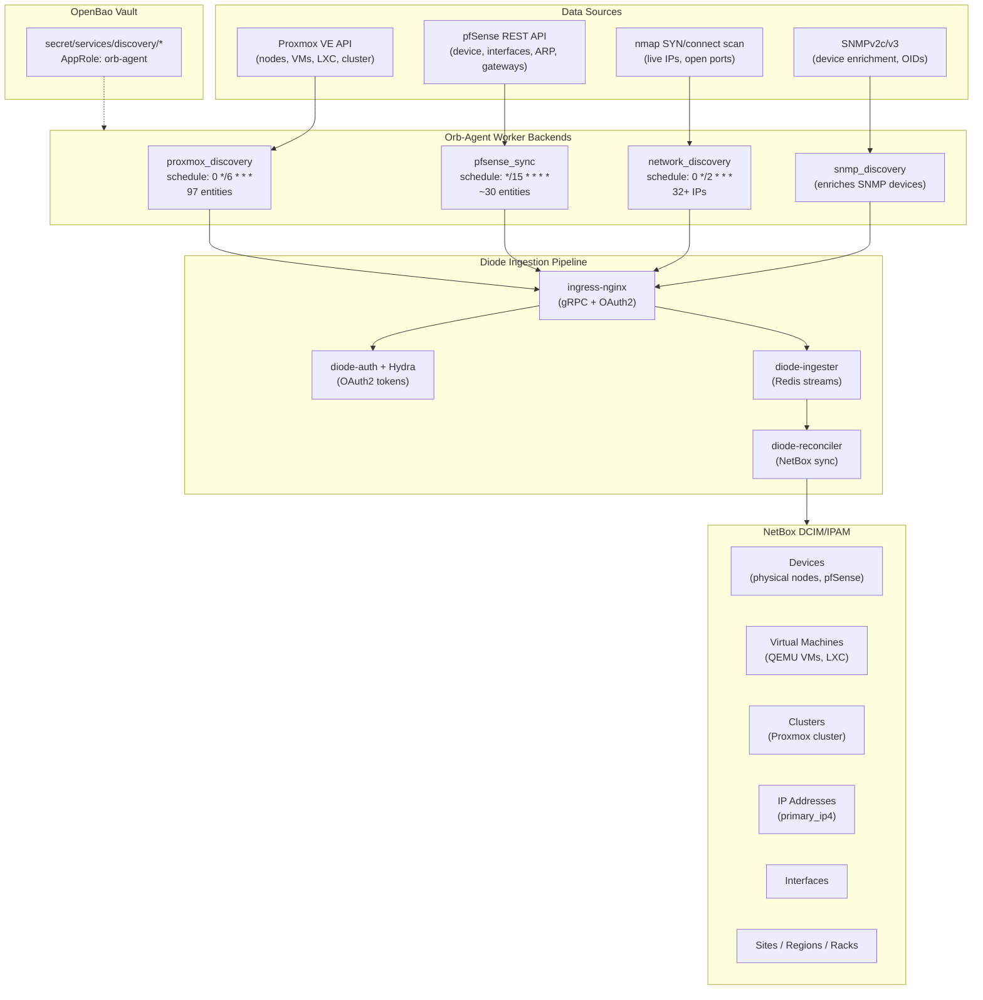

# NetBox Discovery Expansion Plan

**Date:** 2026-04-04 (original) → **2026-04-19** (revised after Phase 2 completion, duplication incident, and cleanup tooling)
**Status:** COMPLETE — All phases through 2c done. Phase D (SNMPv3) and E (LLDP) deferred/optional.

---

## Architecture Overview



### Discovery Tiers

| Tier | Source | Worker | Schedule | Entities | What It Discovers |
|------|--------|--------|----------|----------|-------------------|
| **T1 — Network Scan** | nmap | network_discovery | Every 2h | IPs, ports | Live hosts on 192.168.1.0/24 |
| **T2 — SNMP Enrichment** | SNMPv2c | snmp_discovery | With T1 | Device details | Hostname, manufacturer, model, interfaces, MACs |
| **T3 — API Workers** | Proxmox REST | proxmox_discovery | Every 6h | 97 entities | Nodes, VMs, LXC, interfaces, guest IPs |
| **T3 — API Workers** | pfSense REST | pfsense_sync | Every 15m | ~30 entities | Firewall device, interfaces, ARP, gateways |
| **T4 — Topology** | LLDP/CDP | *(planned)* | — | Cables | Physical network connections |

---

## Current State (2026-04-19)

**Working:**
- **network_discovery** — SYN scan finds 32+ live IPs and open ports on 192.168.1.0/24
- **snmp_discovery** — Enriches SNMP-responsive devices (pfSense: hostname, manufacturer, model, interfaces, MACs)
- **pfsense_sync** — REST API worker pushes device info, interfaces, IPs, gateways, ARP every 15m
- **proxmox_discovery** — API worker pushes 97 entities: 5 nodes, 26 VMs, 6 LXC, with guest agent IPs
- **Orb Agent** — Running with dedicated AppRole, vault-integrated credentials, 4h token TTL
- **Seed data templating** — Region, site, location, tenant, per-node rack assignments all templated from inventory
- **Cleanup tooling** — Generic parameterized `cleanup-netbox.yml` playbook (Semaphore Template 57)

**Remaining gaps:**
- **GPS coordinates** — Code fix deployed (2026-04-21): Site entity now always emitted with lat/lon. Verify on next discovery cycle; fall back to Django shell if Diode reconciler doesn't update existing Site scalars
- **Post-migration cleanup** — After deploying v3.0.0, old Device entries for VMs/LXC will coexist with new VirtualMachine entities. Run cleanup-netbox.yml to remove the orphaned Devices
- **LLDP topology (Phase E)** — Plan and playbooks ready on `feat/lldp-hypervisor-setup` branch. Requires test Proxmox cluster before deploying lldpd to production hypervisors

**Post-cleanup state (32 devices):**
- 1 region (US East), 1 site (Uhstray.io Datacenter), 1 location (Server Room)
- 2 racks (Server Rack, GPU Server Rack)
- 11 devices with rack assignment, 31 with tenant
- Site lat/lon: None (should be 41.19°N, 74.44°W)

---

## Completed Phases

### Phase 1: pfSense REST API Sync — COMPLETE (2026-04-05)

Implemented as orb-agent worker package (`workers/pfsense_sync/`). Runs every 15 minutes. Pushes device info, interfaces, IPs, gateways, and ARP entries via Diode SDK. Device name uses FQDN. Device role: `gateway-router`. Credentials from OpenBao at `secret/services/discovery/pfsense/`.

### Phase 2a: Proxmox Cluster Metadata — COMPLETE (2026-04-16)

Custom orb-agent worker (`workers/proxmox_discovery/`). Queries Proxmox API for nodes (5), VMs (26), LXC containers (6). Maps to NetBox Device entities with resource annotations (CPU, memory, disk). Credentials from OpenBao at `secret/services/discovery/proxmox_api/`.

### Phase 2b: Proxmox Guest Network — COMPLETE (2026-04-16)

Extended Phase 2a with QEMU guest agent queries. VMs with guest agent report interfaces and IPs in NetBox. Falls back gracefully for VMs without guest agent. Total: 97 entities per discovery cycle.

### Phase 2.5: Seed Data Templating — COMPLETE (2026-04-17)

Templated all organizational hierarchy from site-config inventory into `agent.yaml.j2`:
- `discovery_region`, `discovery_site_name`, `discovery_site_latitude`, `discovery_site_longitude`
- `discovery_location_name`, `discovery_tenant_name`
- `discovery_rack_assignments` — per-node rack mapping (Server Rack vs GPU Server Rack)
- `discovery_pfsense_device_role`, `discovery_pfsense_rack`

**Incident:** Missing template vars in Semaphore's inline inventory caused 34→63 device duplication. Fixed by API PUT to sync inventory. See cleanup section below.

### Phase 2.6: Cleanup Tooling — COMPLETE (2026-04-18)

Created `platform/playbooks/cleanup-netbox.yml` — generic parameterized cleanup for Diode-created orphans. Registered as Semaphore Template 57.

**Operations (all default off, dry_run=true for safety):**

| Operation | Extra Var | Description |
|-----------|-----------|-------------|
| Cleanup duplicates | `cleanup_duplicates=true` | Remove duplicate devices by strategy (tenant/lowest_id/highest_id) |
| Replace device | `replace_device_old=X replace_device_new=Y` | Delete old device when replacement exists |
| Migrate region | `migrate_region_old=X migrate_region_new=Y` | Move sites between regions, delete empty source |
| Migrate rack | `migrate_rack_old=X migrate_rack_new=Y` | Move devices between racks, delete empty source |
| Delete orphans | `delete_orphans=true` | Remove regions/racks/locations with zero references |

**Rationale:** Diode is strictly additive — creates and updates but never deletes. Config renames, version bumps, or template variable changes create orphaned objects requiring manual cleanup via Django shell. This playbook provides safe, parameterized cleanup through Semaphore.

---

## Completed Phase

### Phase 2c: Data Enrichment — COMPLETE (2026-04-21)

Closes the remaining data quality gaps before adding new discovery backends.

#### 2c-i: Primary IPv4 Assignment — COMPLETE

Both workers now set `Device.primary_ip4` on every device. Restructured all device builders to collect interface/IP data BEFORE creating the Device entity, enabling `primary_ip4=IPAddress(address=...)` in the initial emit.

- **proxmox_discovery v2.3.0**: `_build_node()` uses first IPv4 from management bridge interfaces. `_build_vm()` uses first guest agent IPv4. `_build_lxc()` uses first container IPv4. Helper `_pick_primary_ipv4()` skips loopback, link-local, and IPv6.
- **pfsense_sync v1.3.0**: Queries interfaces before device creation, finds LAN interface by `descr == "LAN"`, sets its IP as primary.

#### 2c-ii: Proxmox Cluster Modeling — COMPLETE (2026-04-21)

proxmox_discovery v3.0.0: VMs and LXC containers now emit as `VirtualMachine` entities (not `Device`), assigned to a `Cluster` entity queried from the Proxmox API (`prox.cluster.status.get()`). Physical nodes remain as `Device` (role: hypervisor).

**Entity mapping change:**
```
Before:  Node → Device(hypervisor)    VM → Device(server)     LXC → Device(container)
After:   Node → Device(hypervisor)    VM → VirtualMachine     LXC → VirtualMachine
         Cluster(name from API, type="Proxmox VE", scope_site=...)
```

New SDK imports: `Cluster`, `ClusterType`, `VirtualMachine`, `VMInterface`. VMs/LXC now use `VMInterface` (not `Interface`) and `assigned_object_vm_interface` (not `assigned_object_interface`) for IP linking. Resource fields (`vcpus`, `memory`, `disk`) are set directly on VirtualMachine instead of in comments/device_type strings.

**Migration required after deployment:** Old Device entries for VMs/LXC will persist (Diode is additive-only). Run `cleanup-netbox.yml` (Semaphore Template 57) to remove orphaned Device entities that now exist as VirtualMachines.

#### 2c-iii: GPS Coordinates — FIXED (code-side)

Root cause: the standalone Site entity carrying `latitude`/`longitude` was only emitted when `self._region_name` was set. If the Site was created before the region was configured, coords were never sent. Fixed in both workers to always emit the Site entity with available coords regardless of region. If Diode reconciler still doesn't update existing Site scalar fields, fall back to Django shell:

```python
from dcim.models import Site
s = Site.objects.get(name="Uhstray.io Datacenter")
s.latitude, s.longitude = 41.19481797890624, -74.43649455017179
s.save()
```

#### 2c-iv: Description Sanitization — COMPLETE

Added `_sanitize_description()` to the proxmox_discovery worker. Strips lines containing credential keywords (`password`, `passwd`, `secret`, `token`, `key`, case-insensitive regex) from VM and LXC descriptions before Diode ingestion. Returns `None` for fully-redacted descriptions.

---

## Remaining Phases

### Phase D: SNMPv3 Upgrade — moved to [SNMPV3-UPGRADE-PLAN.md](SNMPV3-UPGRADE-PLAN.md)

### Phase E: LLDP Topology Discovery — PLANNED (awaiting test cluster)

**Priority:** MEDIUM — completes the physical topology picture
**Effort:** Medium (Ansible automation + Diode push script)
**Impact:** High (reveals physical cable connections between all devices)
**Blocked by:** Requires installing lldpd on Proxmox hypervisors. Playbooks are on branch `feat/lldp-hypervisor-setup` — to be tested on a dedicated Proxmox test cluster before production deployment.

#### Overview

LLDP (Link Layer Discovery Protocol) maps physical cable connections — which port on device A connects to which port on device B. This creates NetBox Cable entities linking interfaces across devices, completing the topology picture that the existing discovery workers (IPs, interfaces, devices) cannot provide.

#### Current State (2026-04-21)

- **pfSense**: lldpd package installed and running. Chassis: `uhstray.pfsense.lan`, MAC `90:ec:77:8f:6d:4e`, MgmtIP `192.168.1.1`. Capabilities: Router. Already seeing switch neighbors.
- **Proxmox nodes**: lldpd NOT installed. Need Ansible playbook to deploy.
- **Switches**: Multiple managed switches on the network support LLDP as neighbors. They don't need configuration — they're discovered as LLDP neighbors of pfSense and Proxmox nodes.
- **Servers**: Physical servers (Proxmox nodes) will report their connections to switches once lldpd is installed.

#### Data Collection Architecture

pfrest v2 does NOT expose LLDP neighbors via REST API. All LLDP data is collected via SSH using `lldpctl -f json0` (structured JSON format, stable across interface/neighbor counts).

```
Semaphore (scheduled, every 6h)
  → collect-lldp-topology.yml
  → SSH to pfSense + each Proxmox node
  → lldpctl -f json0
  → Python task: parse neighbors, match to NetBox devices
  → Diode SDK: push Cable entities via gRPC
```

#### Implementation Steps

##### E-i: Install lldpd on Proxmox nodes
**Playbook:** `platform/playbooks/install-lldpd.yml`
- Install `lldpd` package via apt
- Configure system name and management address
- Enable and start the service
- Verify LLDP frames are being sent/received
- Target: all Proxmox hypervisor hosts via Semaphore

##### E-ii: Collect LLDP topology and push to Diode
**Playbook:** `platform/playbooks/collect-lldp-topology.yml`
- SSH to pfSense + all Proxmox nodes
- Run `lldpctl -f json0` on each host
- Aggregate neighbor data across all hosts
- Python task: parse JSON, match local/remote chassis to NetBox device names
- Push Cable entities to Diode via SDK (`Cable` with `GenericObject(object_interface=Interface(...))` terminations)
- Run on schedule via Semaphore (every 6h, offset from other discovery)

##### E-iii: Validation
**Playbook:** extend `check-discovery.yml`
- Verify Cable entities appear in NetBox
- Check for stale cables (devices that no longer appear as LLDP neighbors)
- Count cables vs expected connections

#### Diode SDK Cable Entity Pattern

```python
from netboxlabs.diode.sdk.ingester import Cable, Entity, GenericObject, Interface, Device, DeviceType, Manufacturer, Site

# A side: local interface
a_term = GenericObject(
    object_interface=Interface(
        name="eth0",
        device=Device(name="alphacentauri", device_type=DeviceType(model="...", manufacturer=Manufacturer(name="...")), site=Site(name="...")),
    )
)

# B side: remote neighbor interface  
b_term = GenericObject(
    object_interface=Interface(
        name="port24",
        device=Device(name="switch-01", device_type=DeviceType(model="...", manufacturer=Manufacturer(name="...")), site=Site(name="...")),
    )
)

cable = Cable(
    a_terminations=[a_term],
    b_terminations=[b_term],
    status="connected",
    label="LLDP-discovered",
)
entities.append(Entity(cable=cable))
```

#### Device Name Resolution

LLDP neighbor data includes chassis name (sysName), port ID, and port description. These must be matched to existing NetBox device names:

| LLDP Field | NetBox Match |
|------------|-------------|
| Chassis sysName | Device.name (exact match or FQDN→hostname) |
| Port ID (ifname) | Interface.name on the matched device |
| Port description | Fallback for interface name if Port ID is a MAC |
| Management IP | Fallback device lookup via IPAddress.address |

Unresolved neighbors (devices not in NetBox) are logged but don't create cables — you can't cable to a device that doesn't exist in the model.

#### Semaphore Templates

| Template | Playbook | Schedule | Purpose |
|----------|----------|----------|---------|
| Install LLDP | `install-lldpd.yml` | Manual | One-time setup on new nodes |
| Collect LLDP Topology | `collect-lldp-topology.yml` | `0 */6 * * *` | Periodic cable discovery |

---

## Deduplication Strategy

Each discovery source uses a unique `agent_name` / `app_name` to prevent cross-source conflicts:

| Source | Agent Name | Entity Types |
|--------|-----------|--------------|
| network_discovery | `netbox-discovery-agent` | IPAddress (bare) |
| snmp_discovery | `netbox-discovery-agent` | Device, Interface, IPAddress |
| proxmox_discovery | `proxmox-discovery-agent` | Device, VirtualMachine, Cluster, Interface, IPAddress |
| pfsense_sync | `pfsense-sync-agent` | Device, Interface, IPAddress |

**Merge rules:** Proxmox API is authoritative for nodes and VMs. pfSense REST API is authoritative for firewall devices. Network/SNMP discovery fills gaps for non-API-accessible devices.

**Validation:** After Phase 2c deployment, run cleanup playbook in dry-run mode to check for duplicates.

---

## OpenBao Credential Organization

| Path | Contents | Used By |
|------|----------|---------|
| `secret/services/discovery/proxmox_api` | url, token_id, api_token | Proxmox worker |
| `secret/services/discovery/pfsense` | api_key, host | pfSense sync |
| `secret/services/discovery/snmp_v3` | username, auth_password, priv_password | SNMP (Phase D) |
| `secret/services/netbox` | All NetBox secrets | orb-agent, deploy |
| `secret/services/approles/orb-agent` | role_id, secret_id | orb-agent vault auth |

---

## Diode SDK Entity Coverage

**Currently used (17 types):** Cluster, ClusterType, Device, DeviceRole, DeviceType, Entity, Interface, IPAddress, Location, Manufacturer, Platform, Rack, Region, Site, Tenant, VirtualMachine, VMInterface

**Available in SDK v1.10.0 but not yet needed:** Cable, CircuitTermination, ConsolePort, FrontPort, PowerFeed, Prefix, RearPort, VLAN, VLANGroup, VRF, and 70+ more

---

## Implementation Priority

| Phase | Effort | Impact | Status |
|-------|--------|--------|--------|
| 1. pfSense REST API sync | Low | Medium | COMPLETE (2026-04-05) |
| 2a. Proxmox cluster metadata | High | High | COMPLETE (2026-04-16) |
| 2b. Proxmox guest IPs | Medium | High | COMPLETE (2026-04-16) |
| 2.5 Seed data templating | Low | Medium | COMPLETE (2026-04-17) |
| 2.6 Cleanup tooling | Medium | High | COMPLETE (2026-04-18) |
| 2c-i. Primary IPv4 | Low | High | COMPLETE (2026-04-21) |
| 2c-ii. Cluster modeling | Medium | High | COMPLETE (2026-04-21) |
| 2c-iii. GPS coordinates | Low | Low | COMPLETE (2026-04-21) |
| 2c-iv. Description sanitization | Low | Medium | COMPLETE (2026-04-21) |
| D. SNMPv3 upgrade | Medium | Medium | DEFERRED |
| E. LLDP topology | Low-Medium | Medium | OPTIONAL |

---

## Dropped Phases

| Phase | Why Dropped | Alternative |
|-------|-------------|-------------|
| NAPALM device_discovery | No FreeBSD driver for pfSense, Linux driver useless for Proxmox | pfSense REST + Proxmox API workers |

---

## Lessons Learned

1. **Semaphore inventory is an inline copy** — it does NOT read from `site-config/inventory/production.yml`. Must be synced manually via API PUT when inventory vars change. This caused the duplication incident.

2. **YAML `>-` breaks Python in Ansible** — folded scalar collapses multi-line Python into one line, destroying indentation. Use `ansible.builtin.shell` with literal `|` scalar and bash heredoc (`<< 'PYSCRIPT'`).

3. **Diode is additive-only** — never deletes. Any config rename, version bump, or template variable change creates orphans. The cleanup playbook is a permanent operational tool, not a one-time fix.

4. **NetBox v2 API tokens** with pepper-based hashing may return "Invalid v1 token" — workaround: use Django management shell via Semaphore for admin operations.
