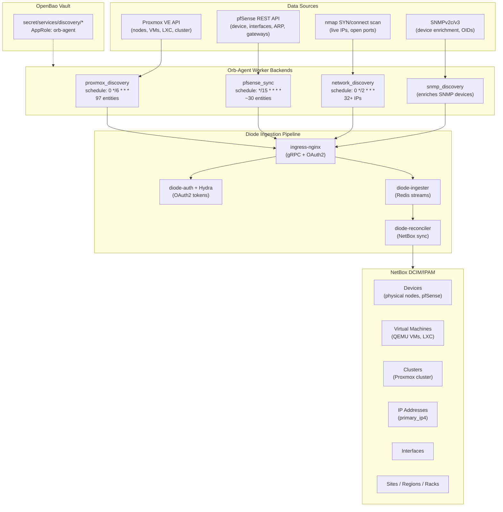

# NetBox Discovery Expansion Plan

**Date:** 2026-04-04 (original) → **2026-04-19** (revised after Phase 2 completion, duplication incident, and cleanup tooling)
**Status:** IN PROGRESS — Phases 1, 2a, 2b complete. Phase 2c (data enrichment) next.

---

## Architecture Overview



### Discovery Tiers

| Tier | Source | Worker | Schedule | Entities | What It Discovers |
|------|--------|--------|----------|----------|-------------------|
| **T1 — Network Scan** | nmap | network_discovery | Every 2h | IPs, ports | Live hosts on 192.168.1.0/24 |
| **T2 — SNMP Enrichment** | SNMPv2c | snmp_discovery | With T1 | Device details | Hostname, manufacturer, model, interfaces, MACs |
| **T3 — API Workers** | Proxmox REST | proxmox_discovery | Every 6h | 97 entities | Nodes, VMs, LXC, interfaces, guest IPs |
| **T3 — API Workers** | pfSense REST | pfsense_sync | Every 15m | ~30 entities | Firewall device, interfaces, ARP, gateways |
| **T4 — Topology** | LLDP/CDP | *(planned)* | — | Cables | Physical network connections |

---

## Current State (2026-04-19)

**Working:**
- **network_discovery** — SYN scan finds 32+ live IPs and open ports on 192.168.1.0/24
- **snmp_discovery** — Enriches SNMP-responsive devices (pfSense: hostname, manufacturer, model, interfaces, MACs)
- **pfsense_sync** — REST API worker pushes device info, interfaces, IPs, gateways, ARP every 15m
- **proxmox_discovery** — API worker pushes 97 entities: 5 nodes, 26 VMs, 6 LXC, with guest agent IPs
- **Orb Agent** — Running with dedicated AppRole, vault-integrated credentials, 4h token TTL
- **Seed data templating** — Region, site, location, tenant, per-node rack assignments all templated from inventory
- **Cleanup tooling** — Generic parameterized `cleanup-netbox.yml` playbook (Semaphore Template 57)

**Gaps (Phase 2c targets):**
- **Primary IPv4** — Not set on any devices. Workers create IPAddress entities but don't assign `Device.primary_ip4`
- **Cluster modeling** — Proxmox cluster not represented. VMs modeled as Device instead of VirtualMachine
- **GPS coordinates** — `site_latitude`/`site_longitude` in worker code but showing None in NetBox (likely Diode reconciler timing or config propagation issue)
- **Credential leakage** — Proxmox VM descriptions contain plaintext passwords synced to NetBox. Needs sanitization filter in worker

**Post-cleanup state (32 devices):**
- 1 region (US East), 1 site (Uhstray.io Datacenter), 1 location (Server Room)
- 2 racks (Server Rack, GPU Server Rack)
- 11 devices with rack assignment, 31 with tenant
- Site lat/lon: None (should be 41.19°N, 74.44°W)

---

## Completed Phases

### Phase 1: pfSense REST API Sync — COMPLETE (2026-04-05)

Implemented as orb-agent worker package (`workers/pfsense_sync/`). Runs every 15 minutes. Pushes device info, interfaces, IPs, gateways, and ARP entries via Diode SDK. Device name uses FQDN. Device role: `gateway-router`. Credentials from OpenBao at `secret/services/discovery/pfsense/`.

### Phase 2a: Proxmox Cluster Metadata — COMPLETE (2026-04-16)

Custom orb-agent worker (`workers/proxmox_discovery/`). Queries Proxmox API for nodes (5), VMs (26), LXC containers (6). Maps to NetBox Device entities with resource annotations (CPU, memory, disk). Credentials from OpenBao at `secret/services/discovery/proxmox_api/`.

### Phase 2b: Proxmox Guest Network — COMPLETE (2026-04-16)

Extended Phase 2a with QEMU guest agent queries. VMs with guest agent report interfaces and IPs in NetBox. Falls back gracefully for VMs without guest agent. Total: 97 entities per discovery cycle.

### Phase 2.5: Seed Data Templating — COMPLETE (2026-04-17)

Templated all organizational hierarchy from site-config inventory into `agent.yaml.j2`:
- `discovery_region`, `discovery_site_name`, `discovery_site_latitude`, `discovery_site_longitude`
- `discovery_location_name`, `discovery_tenant_name`
- `discovery_rack_assignments` — per-node rack mapping (Server Rack vs GPU Server Rack)
- `discovery_pfsense_device_role`, `discovery_pfsense_rack`

**Incident:** Missing template vars in Semaphore's inline inventory caused 34→63 device duplication. Fixed by API PUT to sync inventory. See cleanup section below.

### Phase 2.6: Cleanup Tooling — COMPLETE (2026-04-18)

Created `platform/playbooks/cleanup-netbox.yml` — generic parameterized cleanup for Diode-created orphans. Registered as Semaphore Template 57.

**Operations (all default off, dry_run=true for safety):**

| Operation | Extra Var | Description |
|-----------|-----------|-------------|
| Cleanup duplicates | `cleanup_duplicates=true` | Remove duplicate devices by strategy (tenant/lowest_id/highest_id) |
| Replace device | `replace_device_old=X replace_device_new=Y` | Delete old device when replacement exists |
| Migrate region | `migrate_region_old=X migrate_region_new=Y` | Move sites between regions, delete empty source |
| Migrate rack | `migrate_rack_old=X migrate_rack_new=Y` | Move devices between racks, delete empty source |
| Delete orphans | `delete_orphans=true` | Remove regions/racks/locations with zero references |

**Rationale:** Diode is strictly additive — creates and updates but never deletes. Config renames, version bumps, or template variable changes create orphaned objects requiring manual cleanup via Django shell. This playbook provides safe, parameterized cleanup through Semaphore.

---

## Active Phase

### Phase 2c: Data Enrichment

**Priority:** IMMEDIATE — closes the remaining data quality gaps before adding new discovery backends
**Effort:** Medium (worker code changes + validation)
**Impact:** High (completes the device data model)

#### 2c-i: Primary IPv4 Assignment

**Problem:** Both workers create IPAddress entities and Interface entities, but neither sets `Device.primary_ip4`. Every device in NetBox shows "Primary IPv4: —".

**Fix:** After creating interfaces and IPs for a device, identify the management IP and include `primary_ip4=IPAddress(address="x.x.x.x/24")` in the Device entity kwargs.

**Implementation:**
- **proxmox_discovery**: For nodes, use the IP from `node.network` (management bridge). For VMs/LXC, use the first guest agent IP or fall back to the IP from site-config inventory
- **pfsense_sync**: Use the LAN interface IP (already known from pfSense API response)

**Diode SDK:** `Device(primary_ip4=IPAddress(address="192.168.1.110/24"))` — supported since SDK v1.10.0

#### 2c-ii: Proxmox Cluster Modeling

**Problem:** The Proxmox cluster isn't represented in NetBox. VMs and LXC containers are modeled as Device (physical equipment) instead of VirtualMachine (virtualized workload). No cluster→node→VM hierarchy exists.

**Fix:** Add Cluster, ClusterType, and VirtualMachine entities to the proxmox_discovery worker.

**Implementation:**
1. Import `Cluster`, `ClusterType`, `ClusterGroup`, `VirtualMachine` from Diode SDK
2. Create a `Cluster` entity (name from Proxmox API cluster status, type: "Proxmox VE")
3. Keep physical nodes as `Device` (role: hypervisor) — these are real hardware
4. Switch VMs from `Device` to `VirtualMachine` with `cluster` assignment
5. Switch LXC containers from `Device` to `VirtualMachine` (role: container) with `cluster` assignment

**Entity mapping change:**
```
Before:  Node → Device(hypervisor)    VM → Device(server)     LXC → Device(container)
After:   Node → Device(hypervisor)    VM → VirtualMachine     LXC → VirtualMachine
         Cluster("pve-cluster", type="Proxmox VE", site=...)
```

**Risk:** Switching VM/LXC from Device to VirtualMachine may create duplicates if Diode doesn't reconcile across entity types. May need cleanup run after first deployment. Test with `dry_run` logging before pushing to Diode.

#### 2c-iii: GPS Coordinates

**Problem:** `site_latitude` and `site_longitude` are in the worker code and inventory, but NetBox shows `lat=None lon=None` on the site.

**Diagnosis needed:**
1. Verify the values propagate from `agent.yaml.j2` template → resolved config → worker `config` object
2. Check if Diode reconciler ignores float fields on existing Site entities (reconciler may skip updates to non-null-to-null transitions but might also skip null-to-value)
3. If Diode won't set coords, fall back to Django shell one-liner via Semaphore

**Fallback fix (Django shell):**
```python
from dcim.models import Site
s = Site.objects.get(name="Uhstray.io Datacenter")
s.latitude, s.longitude = 41.19481797890624, -74.43649455017179
s.save()
```

#### 2c-iv: Description Sanitization

**Problem:** Proxmox VM descriptions contain plaintext credentials (root passwords, service passwords) that get synced verbatim to NetBox device descriptions.

**Fix:** Add a sanitization filter in `_build_vm()` and `_build_lxc()` that strips or redacts lines matching common credential patterns before passing to Diode.

**Pattern:** Strip lines matching `password`, `passwd`, `secret`, `token`, `key` (case-insensitive) from descriptions.

---

## Remaining Phases

### Phase D: SNMPv3 Upgrade (deferred)

**Priority:** LOW — security hardening for existing SNMP, not blocking any functionality
**Effort:** Medium (credential setup + snmpd config on pfSense)
**Impact:** Medium (encrypted SNMP on the wire)

Upgrade from SNMPv2c (plaintext community string) to SNMPv3 (SHA auth + AES encryption). Store credentials in OpenBao at `secret/services/discovery/snmp_v3`. Update `agent.yaml.j2` SNMP policies. **Deferred** because the Proxmox API (Phase 2) already provides most device data, and pfSense REST API provides richer data than SNMP.

### Phase E: LLDP Topology Discovery (optional)

**Priority:** LOW — nice-to-have for physical topology mapping
**Effort:** Low-Medium
**Impact:** Medium (reveals physical cable connections)

Query LLDP neighbor data from pfSense REST API or `lldpctl -f json` on nodes. Map neighbors to NetBox Cable objects. Would complete the physical topology picture (which port connects to which).

---

## Deduplication Strategy

Each discovery source uses a unique `agent_name` / `app_name` to prevent cross-source conflicts:

| Source | Agent Name | Entity Types |
|--------|-----------|--------------|
| network_discovery | `netbox-discovery-agent` | IPAddress (bare) |
| snmp_discovery | `netbox-discovery-agent` | Device, Interface, IPAddress |
| proxmox_discovery | `proxmox-discovery-agent` | Device, VirtualMachine, Cluster, Interface, IPAddress |
| pfsense_sync | `pfsense-sync-agent` | Device, Interface, IPAddress |

**Merge rules:** Proxmox API is authoritative for nodes and VMs. pfSense REST API is authoritative for firewall devices. Network/SNMP discovery fills gaps for non-API-accessible devices.

**Validation:** After Phase 2c deployment, run cleanup playbook in dry-run mode to check for duplicates.

---

## OpenBao Credential Organization

| Path | Contents | Used By |
|------|----------|---------|
| `secret/services/discovery/proxmox_api` | url, token_id, api_token | Proxmox worker |
| `secret/services/discovery/pfsense` | api_key, host | pfSense sync |
| `secret/services/discovery/snmp_v3` | username, auth_password, priv_password | SNMP (Phase D) |
| `secret/services/netbox` | All NetBox secrets | orb-agent, deploy |
| `secret/services/approles/orb-agent` | role_id, secret_id | orb-agent vault auth |

---

## Diode SDK Entity Coverage

**Currently used (14 types):** Device, DeviceRole, DeviceType, Entity, Interface, IPAddress, Location, Manufacturer, Platform, Rack, Region, Site, Tenant

**Phase 2c additions (4 types):** Cluster, ClusterType, ClusterGroup, VirtualMachine

**Available in SDK v1.10.0 but not yet needed:** Cable, CircuitTermination, ConsolePort, FrontPort, PowerFeed, Prefix, RearPort, VLAN, VLANGroup, VRF, and 70+ more

---

## Implementation Priority

| Phase | Effort | Impact | Status |
|-------|--------|--------|--------|
| 1. pfSense REST API sync | Low | Medium | COMPLETE (2026-04-05) |
| 2a. Proxmox cluster metadata | High | High | COMPLETE (2026-04-16) |
| 2b. Proxmox guest IPs | Medium | High | COMPLETE (2026-04-16) |
| 2.5 Seed data templating | Low | Medium | COMPLETE (2026-04-17) |
| 2.6 Cleanup tooling | Medium | High | COMPLETE (2026-04-18) |
| **2c-i. Primary IPv4** | **Low** | **High** | **TODO — next** |
| **2c-ii. Cluster modeling** | **Medium** | **High** | **TODO** |
| **2c-iii. GPS coordinates** | **Low** | **Low** | **TODO** |
| **2c-iv. Description sanitization** | **Low** | **Medium** | **TODO** |
| D. SNMPv3 upgrade | Medium | Medium | DEFERRED |
| E. LLDP topology | Low-Medium | Medium | OPTIONAL |

---

## Dropped Phases

| Phase | Why Dropped | Alternative |
|-------|-------------|-------------|
| NAPALM device_discovery | No FreeBSD driver for pfSense, Linux driver useless for Proxmox | pfSense REST + Proxmox API workers |

---

## Lessons Learned

1. **Semaphore inventory is an inline copy** — it does NOT read from `site-config/inventory/production.yml`. Must be synced manually via API PUT when inventory vars change. This caused the duplication incident.

2. **YAML `>-` breaks Python in Ansible** — folded scalar collapses multi-line Python into one line, destroying indentation. Use `ansible.builtin.shell` with literal `|` scalar and bash heredoc (`<< 'PYSCRIPT'`).

3. **Diode is additive-only** — never deletes. Any config rename, version bump, or template variable change creates orphans. The cleanup playbook is a permanent operational tool, not a one-time fix.

4. **NetBox v2 API tokens** with pepper-based hashing may return "Invalid v1 token" — workaround: use Django management shell via Semaphore for admin operations.
